# Architecture review — nora — 2026-09-02

**Scope**: The interpreter core under `src/` (the pipeline SourceStream → Lex → Parse → AST → Interpreter → Runtime), weighted toward the git hot spots `src/Parse.cpp`, `src/include/AST.h`, `src/Interpreter.cpp`, `src/AST.cpp`, `src/Lex.cpp` (each ~13–17 commits, last touched 2026-07-02). The MLIR scaffold under `src/mlir/` and `src/include/nir/` is out of scope: it is opt-in, unused by the interpreter, and the project guide forbids adding it to the default build path.
**Picked**: `value-printing-raw-ostream-seam` — see the PR and `.architecture/backlog.md`.
**Degradations**: none. `codebase-design` loaded; a read-only `Explore` sub-agent performed the reconnaissance; `gh` is authenticated; the quality gate (`ctest --preset release`, 21 tests wrapping 88 `.rkt` integration tests) is green at baseline.

**Diagram convention**: solid edges are the module's **interface** (what a caller must cross); dashed edges are **implementation** internal to the module.

---

## Candidates

### `value-printing-raw-ostream-seam` — Route value printing through one injected `raw_ostream` seam · Strong · score 22/25

- **Files** — `src/include/AST.h:118` (the `virtual void write() const = 0` on `ValueNode`) and its ~16 overrides across `src/include/AST.h`, `src/AST.cpp` (`Symbol:85`, `Keyword:95`, `Char:104`, `String:113`, `Integer:192`, `Lambda:250`, `CaseLambda:274`, `Values:453`, `VariableReference:481`, `Void:544`, `List:581`, `Vector:622`, `QuotedExpr:658`), `src/include/ASTRuntime.h` + `src/ASTRuntime.cpp` (`Closure:29`, `CaseLambdaClosure:45`, `ContinuationMarkSet:112`), and the single external caller `src/main.cpp:80`. File-count estimate: **~5–6** (the four production files plus `test/unit/test_parse.cpp` for the pinning test).
- **Score** — **22/25**
  - Leverage **5**: the deepening pays back across all ~16 `write` sites at once (each stops choosing its own sink) *and* removes a whole class of test setup — value-printing behaviour that is integration-only today (subprocess + FileCheck) becomes assertable in-process via `llvm::raw_string_ostream`.
  - Locality **4**: the "which values are self-quoting" rule (today duplicated in `QuotedExpr::write` at `AST.cpp:662-663` and restated in ~6 header comments) and the choice of output channel both concentrate into one place.
  - Blast radius **2**: 5–6 files, a module and its direct caller; `write()` is internal to the `norac` binary, not a published/exported interface — no wire format or CLI contract changes.
  - Heat **4**: `AST.h`/`AST.cpp` are among the hottest files in the tree.
- **Problem** — Value printing is not a module at all; it is scattered across ~16 node overrides that each hard-wire their own output channel. There are **three** unsynchronised sinks: `std::cout` (most nodes), `llvm::outs()` (`RuntimeFunction::write`, `AST.h:980-982`), and C stdio via `gmp_printf` (`Integer::write`, `AST.cpp:192`). The header already documents the hazard at `AST.h:393-395` ("Use `std::cout` … `llvm::outs()` buffers independently and would reorder") and fixed `BooleanLiteral`, but the other two channels remain — so a result mixing a runtime function or integer with `std::cout` output can interleave out of order. The interface (`write()` to an ambient global) is *shallower than shallow*: it hides no dependency and its side effect cannot be observed except through a subprocess.
- **Deletion test** — Delete the ambient-`std::cout` style and force every writer through one passed `raw_ostream&`: complexity **concentrates** into one seam and one self-quoting predicate, and the three-channel interleaving hazard vanishes. Concentrates, not moves — a genuine deepening candidate.
- **Solution** — Change the interface to `virtual void write(llvm::raw_ostream &OS) const`, thread `OS` through all ~16 overrides, replace `gmp_printf` with `OS << asString()` (the method already exists on `Integer`), retire `llvm::outs()` in `RuntimeFunction::write`, and have `main.cpp` pass a single `llvm::outs()` for both its own result line and the trailing newline so nothing interleaves. Extract one `bool ValueNode::isSelfQuoting() const` to replace the duplicated `isa<>` chain. Behaviour-preserving: `Closure::write`/`CaseLambdaClosure::write` stay empty (their empty output is load-bearing and pinned by tests); the printed forms are unchanged.
- **Benefits** — **Leverage**: one interface change pays back across 16 sites and unlocks in-process assertions for the 20+ `quote*.rkt`/`char-*.rkt`/`values*.rkt` printed-form tests. **Locality**: self-quoting knowledge and channel choice live in one place; fix once, fixed everywhere. **Test surface**: this is the point — printed form becomes testable *through the interface* (`raw_string_ostream`) instead of past it (subprocess stdout), which is the `codebase-design` principle "accept dependencies, don't create them" applied to output.

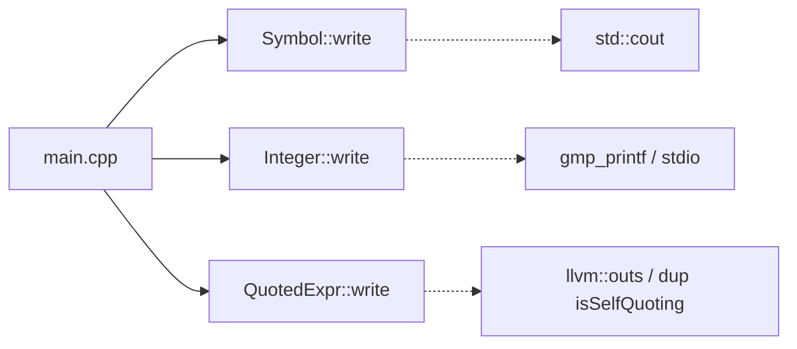

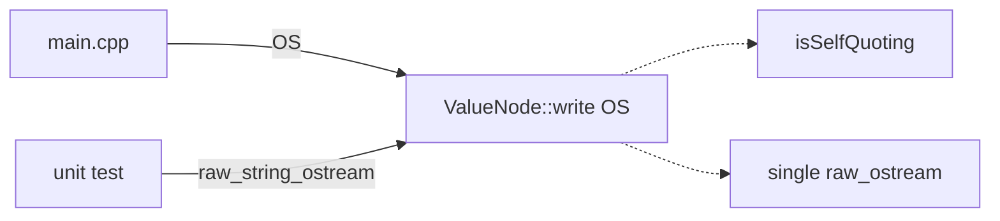

### `frame-per-kind-continuation` — Split the fat `Frame` struct into per-kind continuation types · Worth exploring · score 22/25

- **Files** — `src/include/Interpreter.h:84-146` (`struct Frame`, ~15 kind-specific fields valid only per `Kind`), `continueStep()`'s 13-arm switch `src/Interpreter.cpp:140-384`, and every `visit()` that constructs a frame (`Application:575`, `IfCond:608`, `LetValues:636`, `WithContinuationMark:699`, `SetBang`, …). File-count estimate: **2**, but the edit surface is the entire ~500-line evaluation core.
- **Score** — **22/25**. Leverage **5**: the CEK machine is the highest-behaviour interface in the tree. Locality **5**: each frame kind's push/resume logic would concentrate in one type instead of being spread across a fat struct, a switch arm, and a `visit`. Blast radius **3** (inverted → contributes 3): only 2 files, but "how much code the refactor touches" (the rubric's definition, with the file table demoted to a sanity check) is the whole evaluation loop — the largest code volume of any candidate. Heat **4**.
- **Problem** — The field-validity invariant ("which of the ~15 fields are live for which `Kind`") lives only in the programmer's head and leaks to every construction and consumption site; understanding one form means reading its `visit`, its switch arm, and `applyProcedure`.
- **Deletion test** — Replacing the fat struct + switch with per-kind frame types (a `std::variant`, or a polymorphic `Frame::resume(Interpreter&)`) concentrates each kind's transition in one place. Concentrates.
- **Solution** — One small type per `Kind` holding only its fields, each with a `resume()` transition; `continueStep` becomes dispatch.
- **Benefits** — **Leverage** and **locality** are both maximal; the **test surface** improves because a frame's transition becomes unit-addressable. But this is the core machine and the riskiest change in the report — it wants characterization tests written first.

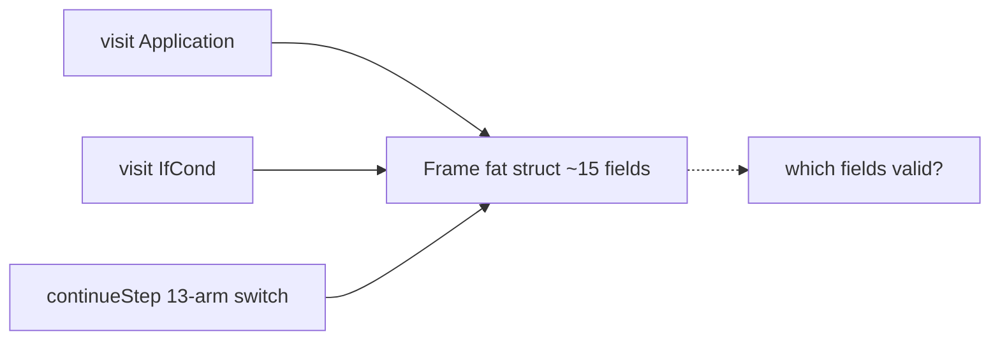

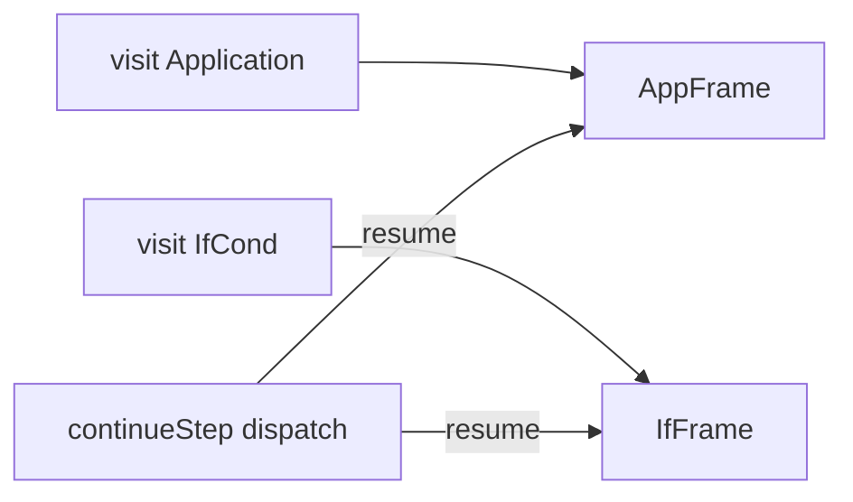

### `formal-deep-interface` — Give `Formal` a deep interface for arity, binding, and bound vars · Strong · score 21/25

- **Files** — `src/include/AST.h:480-565` (`Formal` exposes only `getType()` + `clone()`), with its `Type` enum re-dispatched via `switch`/`static_cast` at `src/Interpreter.cpp:85-95` (`formalsAccept`), `:430-450` (inline arity check, with *different* error text than `formalsAccept`), `:478-508` (argument binding), and `src/AST.cpp:213-244` (`Lambda::dump`). File-count estimate: **3** (`AST.h`, `AST.cpp`, `Interpreter.cpp`).
- **Score** — **21/25**. Leverage **4**: four dispatch sites collapse and a deeply-nested caller (`applyProcedure`) stops reaching past the seam. Locality **4**: adding a formal kind or changing arity/binding today forces edits in four places. Blast radius **1** (→5): 3 files, no published interface. Heat **4**.
- **Problem** — `Formal` is a shallow tag: its interface (`getType`) is as complex as knowing which subclass you hold, so every behaviour (arity acceptance, argument binding, bound-variable collection) is re-implemented at the call sites. A concrete latent inefficiency rides along: `auto LF = static_cast<const ast::ListFormal &>(F)` at `Interpreter.cpp:480/487/500` **copies** the formals `SmallVector` on every application (a `const&` won't compile because `operator[]` is non-const at `AST.h:539`).
- **Deletion test** — Replace the tag-plus-switch with virtuals on `Formal`: complexity concentrates into `Formal`. Concentrates.
- **Solution** — Add `bool accepts(size_t nargs) const`, an argument-binding method, and `SmallVector<Identifier> boundVars() const`; make `operator[]` const. Collapses `formalsAccept`, the inline arity check, the binding switch, and `Lambda::dump`'s switch, and lets a canonical arity-error message replace the two divergent ones.
- **Benefits** — **Leverage** across four sites, strong **locality**, and the copy bug disappears. **Test surface**: arity/binding become unit-addressable on `Formal`.

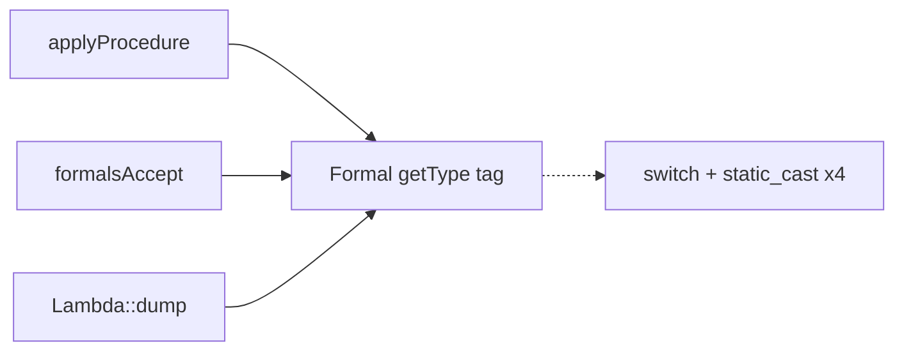

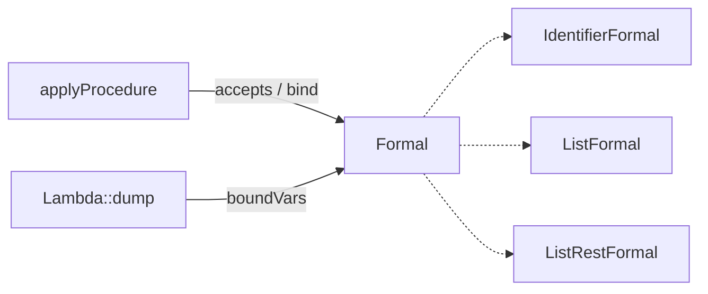

### `parse-form-combinators` — Fold repeated parse prologue and diagnostic idiom into combinators · Worth exploring · score 20/25

- **Files** — `src/Parse.cpp`: the `getPosition → gettok LPAREN → rewindTo → gettok KEYWORD → rewindTo` prologue repeated in ≥10 functions (`parseDefineValues:498`, `parseValues:564`, `parseLambda:700`, `parseCaseLambda:752`, `parseBegin:874`, `parseSetBang:963`, `parseVariableReference:1017`, `parseIfCond:1087`, `parseWithContinuationMark:1148`, `parseLetValues:1220`), the `if (!hadError(S)) parseError(...)` idiom repeated ~15×, and the hand-rolled ordered dispatch in `parseExpr:211-292`. Plus `src/include/Parse.h`. File-count estimate: **2**, ~10–15 functions.
- **Score** — **20/25**. Leverage **4** (10+ functions simplify). Locality **4** (form-opening + error idiom concentrate). Blast radius **2** (→4): 2 files but many internal edits in the largest, most-churned file. Heat **4**.
- **Problem** — Every form parser threads `SourceStream` position/rewind manually, leaking the tokenizer's positional model to every caller. A latent correctness gap rides along: `VOID`/`RAISE_ARGUMENT_ERROR`/`PROCEDURE_ARITY_INCLUDES_C`/`MAKE_STRUCT_TYPE` are lexed as dedicated tokens but no expression parser consumes them, so `(void)` in expression position cannot parse.
- **Deletion test** — An `openForm(S, Keyword)` guard + `expect(S, TokType, msg)` combinator + a keyword→parser table concentrate the boilerplate. Concentrates.
- **Solution** — Behaviour-preserving extraction of the prologue and the `hadError`/`parseError` idiom into combinators; the `(void)` fix and error-regime convergence are documented follow-ups, not part of the extraction.
- **Benefits** — **Leverage** across ~10 parsers, **locality** for form-opening; **test surface** already strong (`test_parse.cpp` + dozens of `.rkt`).

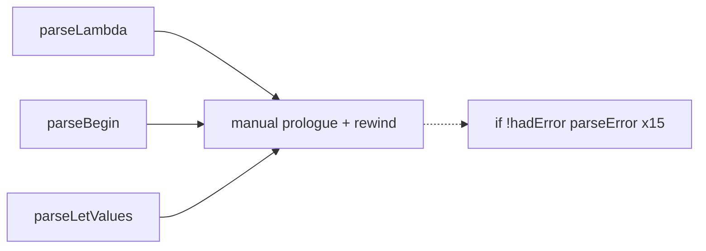

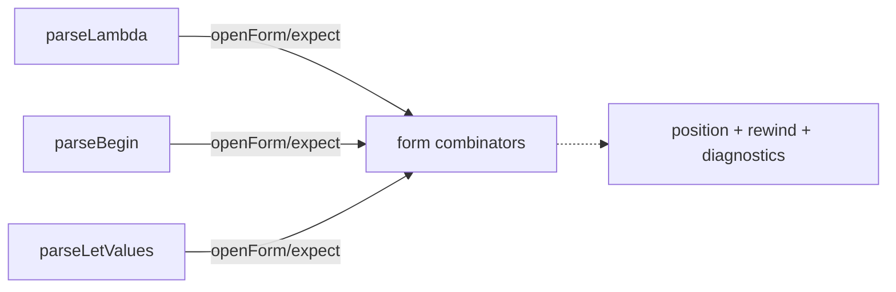

### `bind-result-helper` — Unify multiple-values destructuring across let/letrec/define · Worth exploring · score 19/25

- **Files** — `src/Interpreter.cpp:54-82` (`bindValues`) vs the `Frame::Define` arm reimplementing the same "1 id → value / N ids → arity-checked `Values`" logic at `:278-313`, with different error text (`:69-72` vs `:297-301`). File-count estimate: **1–3**.
- **Score** — **19/25**. Leverage **3** (two call sites simplify). Locality **4** (a divergent-bug site is eliminated). Blast radius **1** (→5). Heat **4**.
- **Problem** — The multiple-values binding logic exists twice with divergent error text; the root cause is that `ast::Values` (`AST.h:828-865`) does double duty as surface syntax and runtime result, forcing both paths to `clone()` then `dyn_cast`. A shared gap: `(let-values (((x) (values 1 2))) x)` does not error because `size(ids)==1` binds whatever arrived.
- **Deletion test** — Extract `bindResult(Diag, Loc, Scope, Ids, value)` used by LetBind, LetRec, and Define: concentrates.
- **Solution** — Extract the helper; optionally introduce a distinct runtime `MultipleValues` value to remove the clone-then-downcast.
- **Benefits** — **Locality** (one binding rule), **leverage** across two sites; **test surface** via existing `let-values*/letrec-values*/define-values*` tests.

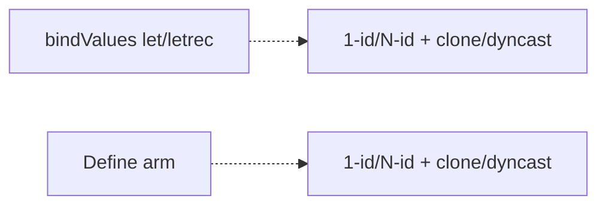

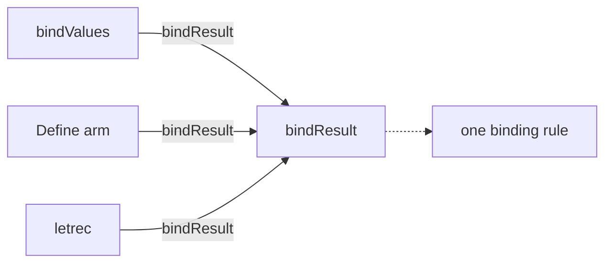

### `environment-deepen` — Fold Environment + Scope + cycle-breaking into one module · Speculative · score 18/25

- **Files** — `src/include/Environment.h` + `src/Environment.cpp` (`Environment` flat map, `Scope` chain, free functions `envLookup`/`envSet`/`envExtend`), and the Interpreter reaching past the abstraction to break cycles via `AllScopes` + destructor loop (`src/Interpreter.cpp:31-49`, `Interpreter.h:187-191`), plus `Identifier::operator<=>` (`src/AST.cpp:68-73`). File-count estimate: **4**.
- **Score** — **18/25**. Leverage **4**. Locality **4**. Blast radius **2** (→4): `operator<=>` affects every `std::map<Identifier,…>`. Heat **2**: `Environment.cpp` is cold (2 commits) — YAGNI docks this hard.
- **Problem** — Scoping is split across three layers; the Interpreter owns cycle-breaking that belongs to the scope abstraction. Two hidden inefficiencies: `envSet` calls `lookup` (which `clone()`s the value) purely to test membership, and `operator<=>` does a byte-wise compare even though `IdPool` guarantees pointer-unique backing strings. Dead surface: `envExtend`, `Environment::begin/end`.
- **Deletion test** — Fold the layers into one `Scope`/`Environment` with `contains()`, arena ownership, and pointer identity: concentrates.
- **Solution** — Add `contains()`; switch identity to interned-pointer comparison; move cycle-breaking into the scope arena; delete the dead surface.
- **Benefits** — **Locality** for scoping, **leverage** on set!/lookup; behaviour-neutral perf win.

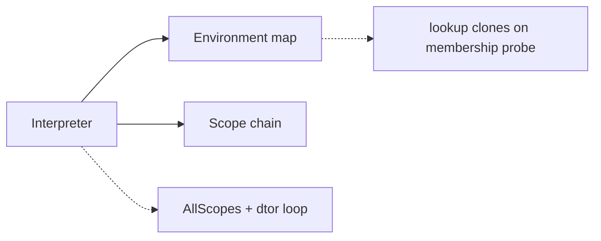

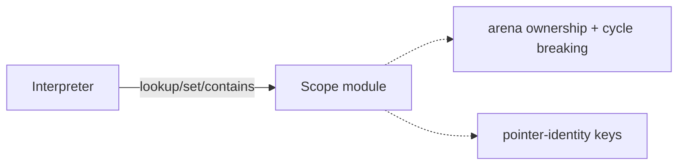

### `visitor-defaults-dead-code` — Default `ASTVisitor` no-ops and remove the dead free-vars pass · Speculative · score 16/25

- **Files** — `src/include/ASTVisitor.h:7-38` (27 pure virtuals, no defaults), the dead `src/AnalysisFreeVars.{cpp,h}` (never instantiated; `Lambda::findFreeVariables` at `AST.h:640` is declared but undefined), the ~15 empty self-evaluating overrides in `src/Interpreter.cpp:717-775`, and CMake entries. File-count estimate: **3–5**.
- **Score** — **16/25**. Leverage **3**. Locality **3**. Blast radius **2** (→4). Heat **3**.
- **Problem** — Adding an AST node forces edits to AST.h, ASTVisitor.h, Interpreter.h/.cpp, and the dead AnalysisFreeVars — 6+ files, one of them dead weight.
- **Deletion test** — (i) Deleting the dead pass makes complexity *vanish* (a cleanup, not a deepening); (ii) defaulting the visitor's virtuals to no-ops concentrates the "nothing to do" cases in the base — that half concentrates.
- **Solution** — Remove `AnalysisFreeVars.{h,cpp}` + `findFreeVariables` + their CMake entry; give `ASTVisitor` defaulted no-op bodies (or a `visitSelfEvaluating` hook).
- **Benefits** — **Leverage**/**locality** modest; mostly reduces per-visitor boilerplate and dead weight.

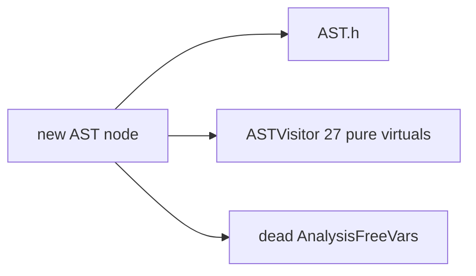

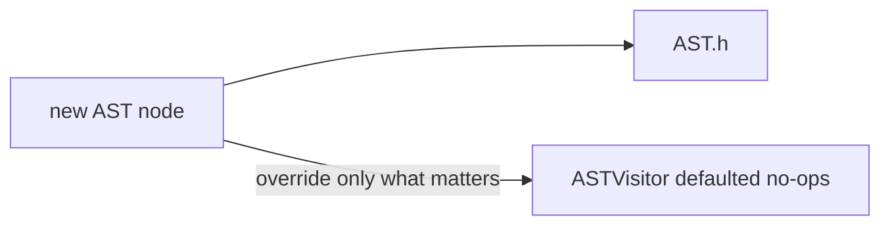

---

## Dropped

None. No candidate trips a hard filter: every candidate has leverage ≥ 3 (none fails the deletion test outright), none has blast radius 5, there are no ADRs to contradict (`docs/adr/` does not exist), the backlog is new, and every candidate's behaviour is pinnable by the existing Catch2 + lit suites.

| Candidate | Dropped because |
|---|---|
| _(none)_ | — |

## Too large to automate

None. The largest candidate (`frame-per-kind-continuation`) is blast radius 3, implementable in one PR (behind characterization tests); it is not blast radius 5.

## Pick

**`value-printing-raw-ostream-seam`, 22/25.** It ties `frame-per-kind-continuation` (also 22/25) at the top and is separated by the rubric's deterministic tie-break — **lower blast radius wins**: value-printing touches 5–6 files and no evaluation-core code (blast 2), whereas the Frame split rewrites the entire ~500-line CEK loop (blast 3). Three candidates sit within one point (22 / 22 / 21), so the pick was close:

- **Runner-up candidate: `frame-per-kind-continuation` (22/25)** — equal score, deeper structurally, but the riskiest change in the tree and correctly deprioritised by blast radius. It wants characterization tests first.
- **`formal-deep-interface` (21/25)** is the safest, most textbook "shallow tag → deep module" refactor and is the **natural next firing** after this one lands.

Value-printing was chosen on its own merits, not to avoid the others: it is the report's clearest *testability* win (it converts 20+ integration-only printed-form tests into in-process assertions — exactly the aim of the exercise), it fixes a real latent interleaving bug the codebase already documents, and it is well-pinned by the existing `quote*/char-*/values*` suites so a behaviour-preserving extraction is safe.

## Design

_Written in step 4 (design-it-twice + adjudication); appended below after the report and backlog were committed._
