# Architecture review — nora — 2026-09-03

**Scope**: Hot-spot modules of the interpreter pipeline — `Parse.cpp`/`Lex.cpp`
(reader), `AST.h`/`AST.cpp` (node hierarchy), and `Interpreter.cpp`/`Runtime.cpp`/
`Environment`/`AnalysisFreeVars` (evaluator). Chosen because the last ~150 commits
concentrate there (M1 tail calls, M2 mutable values, the Boehm-GC value-model
migration), so deepening those seams pays back on the changes still in flight.
**Picked**: `parse-form-combinator` — **not implemented this firing** (blocked, see
*Pick* and the run log in `.architecture/backlog.md`).
**Degradations**: none. `gh` authenticated; both exploration passes ran as
sub-agents.

> **Diagram convention**: solid edges are the module's public **interface**;
> dashed edges are **inside** the implementation, behind the seam.

## Candidates

### `parse-form-combinator` — collapse the 11 special-form parse handlers onto one `(keyword …)` seam · Strong · score 21/25

- **Files**: `src/Parse.cpp` (the 11 keyword-form handlers: `parseDefineValues`
  :504, `parseValues` :570, `parseLambda` :706, `parseCaseLambda` :758,
  `parseBegin` :880, `parseSetBang` :969, `parseVariableReference` :1022,
  `parseIfCond` :1093, `parseWithContinuationMark` :1154, `parseLetValues` :1226,
  `parseQuote` :1347), `src/include/Parse.h`, `test/unit/test_parse.cpp`.
  **File-count estimate: 2–3.**
- **Score 21/25** — leverage 4, locality 4, blast radius 1, heat 4
  - *Leverage 4*: 11 call sites simplify to a keyword + a body lambda; the shared
    open/keyword/close/range/error handling is written once. Not a 5 — it does not
    by itself remove a whole class of test setup.
  - *Locality 4*: adding a new special form, or changing how forms are opened,
    closed, or ranged, becomes a one-place edit instead of a copy into a new
    handler.
  - *Blast radius 1*: contained to the reader; no published interface changes;
    2–3 files.
  - *Heat 4*: `Parse.cpp` is the most-churned source file (16 revisions) though its
    last touch was 2026-07-02; the reader is exercised by every one of the 93
    integration tests.
- **Problem**: each keyword-form handler repeats a byte-identical prologue —
  `Start = getPosition(); T = gettok(S); if (!T.is(LPAREN)) { rewindTo(Start);
  return nullptr; } NodeStart = T.Start; T = gettok(S); if (!T.is(<KEYWORD>)) {
  rewindTo(Start); return nullptr; }` — and a near-identical epilogue —
  `T = gettok(S); if (!T.is(RPAREN)) { if (!hadError(S)) parseError(…"to close
  <name>"); return nullptr; } Node->setRange(rangeFrom(S, NodeStart)); return
  Node;`. The `(`, the keyword match, the backtrack-on-miss, the `)` expectation,
  and the range bookkeeping are protocol every handler must re-implement
  correctly; only the middle (parse the body, build the node) differs. The
  interface a handler exposes is nearly all boilerplate around a small body.
- **Deletion test**: **concentrates**. There is no module to delete today — the
  protocol is smeared across 11 functions. Introducing one `parseKeywordForm`
  seam pulls that smeared logic into a single place; deleting *that* seam would
  scatter it back across 11 handlers. Complexity concentrates behind the seam,
  which is the signal to build it.
- **Solution**: add a `static` member template on `Parse`,
  `parseKeywordForm(S, Tok::TokType keyword, const char *closeName, bodyFn)`, that
  consumes `(`, matches the keyword (backtracking to `Start` and returning
  `nullptr` on a miss so `parseExpr`'s waterfall is unaffected), runs `bodyFn` to
  parse the middle and build the node, expects `)` (emitting the verbatim
  close-message on failure), and stamps `rangeFrom(S, NodeStart)`. Each handler
  becomes its body lambda. **`parseExpr`'s try-in-order dispatch is left exactly as
  is** — converting it to keyword dispatch changes which handler reports errors for
  malformed input, which the `error-*.rkt` tests assert against; that is a separate
  follow-up (`parse-expr-keyword-dispatch`).
- **Benefits**: **leverage** — the open/close/range/backtrack protocol is learned
  and verified once, not eleven times; a bug in it (e.g. the range off-by-one the
  lexer comments already worry about) is fixed in one place. **Locality** — new
  forms and protocol changes stop touching every handler. **Test surface** — the
  combinator is a `Parse` member declared in `Parse.h` beside the existing 27
  `parseXxx`, so `test_parse.cpp` can drive a form directly; the red test pins the
  seam before the handlers move onto it.
- **Recommendation strength**: Strong.

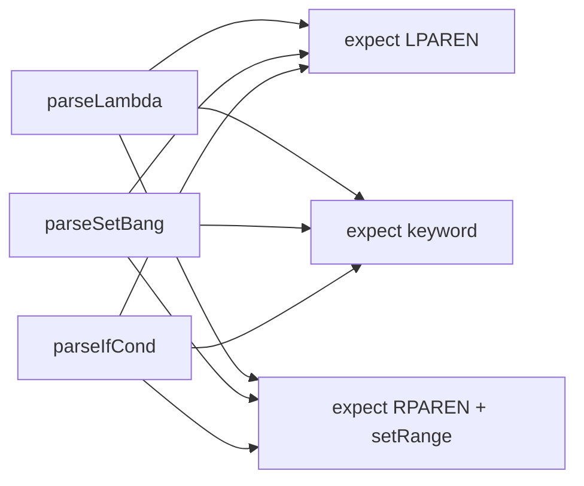

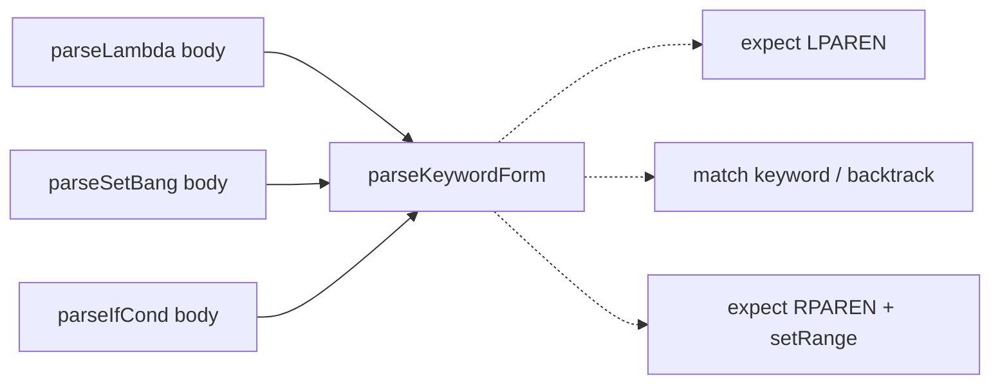

### `runtime-builtin-prologue` — replace 18 builtin classes with typed primitive descriptors · Strong · score 21/25

- **Files**: `src/Runtime.cpp:7-486` (18 `RuntimeFunction` subclasses),
  `src/include/Runtime.h`, `src/include/ASTRuntime.h`, `src/Interpreter.cpp:435-456`
  (the generic error sink). **File-count estimate: 3–5.**
- **Score 21/25** — leverage 5, locality 4, blast radius 3, heat 4
  - *Leverage 5*: removes 36 boilerplate `clone`/`accept` methods + 18 forwarding
    ctors + ~21 copied arity/type-unwrap guards, and closes a real error channel.
  - *Locality 4*: arity and argument-type rules for a primitive move into one
    descriptor row.
  - *Blast radius 3*: several modules, and it touches the builtin argument/return
    surface that is **mid-migration to `nr_value`** (see
    `docs/value-model-gc-migration.md`) plus the error text that `error-*.rkt`
    integration tests assert — refactoring an interface still in flux inflates the
    radius.
  - *Heat 4*: `Runtime.cpp` was last touched 2026-09-02 (the `eq?`/`gensym` work).
- **Problem**: every builtin (`AddFunction` … `GensymFunction`) hand-rolls a ctor,
  `clone()`, and `accept()` whose bulk dwarfs the 1–3 line payload, and its only
  failure channel is `return nullptr`. `Interpreter::applyProcedure` turns every
  null into one generic `"invalid arguments to 'X'"`, so "car of a non-pair",
  "wrong arity", and "unsupported operand" are indistinguishable and the message
  is manufactured in a different translation unit from the check that failed.
- **Deletion test**: **concentrates** — a table of `Primitive { arity; typed
  signature; body }` behind one dispatch/unwrap seam absorbs the guards and gives
  each primitive a real diagnostic; deleting the seam scatters the boilerplate
  back across 18 classes.
- **Solution**: a primitive descriptor table + a shared `checkArity` / `unwrapAs<T>`
  seam that raises a specific diagnostic once.
- **Benefits**: **leverage** across 18 sites; **locality** of arity/type rules;
  **test surface** — a primitive's error behaviour becomes unit-testable instead of
  only observable as a null far downstream.
- **Recommendation strength**: Strong.

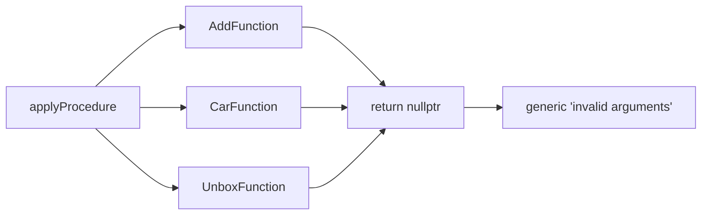

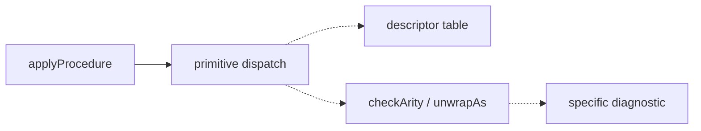

### `formal-variant-tag-dispatch` — give `Formal` the polymorphic methods its 5 consumers hand-roll · Worth exploring · score 20/25

- **Files**: `src/include/AST.h:490-575` (`Formal` exposes only `getType()`),
  `src/AST.cpp:235-262`, `src/Interpreter.cpp:85-95, 466-484, 512-542`,
  `src/AnalysisFreeVars.cpp:43-57`. **File-count estimate: 4.**
- **Score 20/25** — leverage 4, locality 4, blast radius 2, heat 4
  - *Leverage 4*: 5 `switch`-on-tag-then-`static_cast` chains collapse to virtual
    calls, and the closure arity check (`Interpreter.cpp:466-484`) that duplicates
    `formalsAccept`'s List/ListRest logic is unified.
  - *Locality 4*, *Blast radius 2* (4 files, no published interface), *Heat 4*
    (`Interpreter.cpp` and `AST.h` both churned into September).
- **Problem**: `Formal` is a variant whose only public method is a type tag, so
  every consumer reconstructs the concrete subtype by hand — the textbook
  match-on-tag-then-unwrap leak — and the arity logic is written twice.
- **Deletion test**: **concentrates** — hoisting `accepts(nArgs)`, `boundIds()`,
  and `bind(scope, args)` (plus a `formatTo` for dump) onto `Formal` moves the
  logic behind the interface; the 5 switches become virtual dispatch.
- **Solution**: three polymorphic methods on `Formal`, implemented once per
  subtype.
- **Benefits**: **leverage** at 5 sites; **locality** — a fourth formal shape is
  one subclass, not a fifth switch arm; **test surface** — arity/binding testable
  per formal kind.
- **Recommendation strength**: Worth exploring.

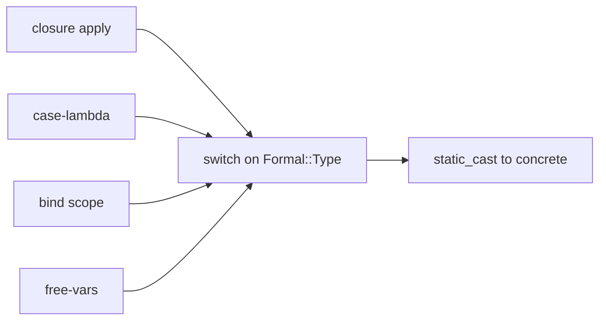

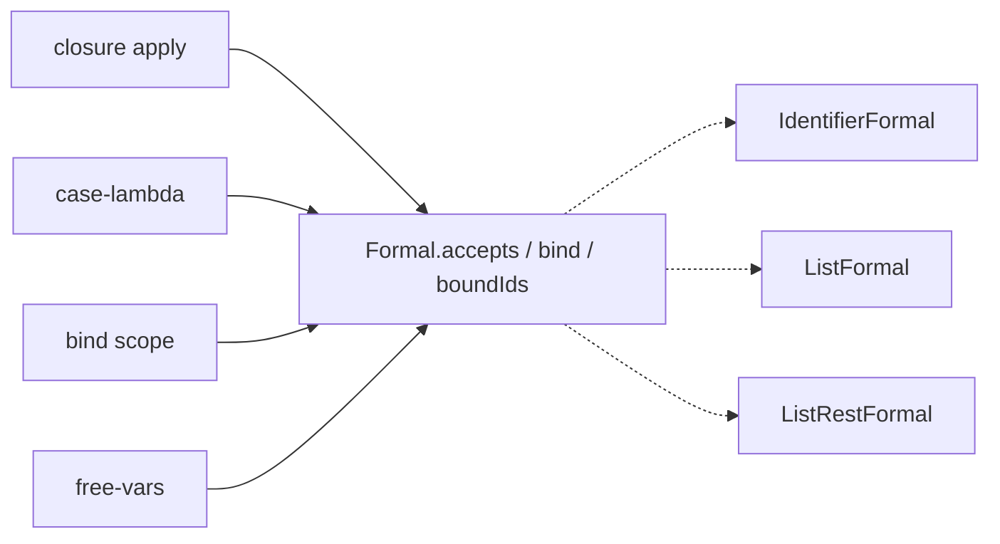

### `lex-token-cursor-seam` — add peek/expect/consumeIf so 70 handlers stop hand-rolling gettok+rewind · Worth exploring · score 20/25

- **Files**: `src/include/Lex.h`, `src/Lex.cpp`, `src/Parse.cpp` (pervasive).
  **File-count estimate: 3**, but a large `Parse.cpp` diff (~70 call sites).
- **Score 20/25** — leverage 5, locality 4, blast radius 3, heat 3
  - *Leverage 5*: 70 `gettok` + 61 rewinds + 53 paren-checks route through one
    cursor; the two competing backtrack idioms (`rewindTo(Start)` 53×,
    `rewind(T.size())` 8×) unify.
  - *Blast radius 3*: touches ~70 sites across the repo's largest file and the
    lexer's public surface — too broad to land and review comfortably in one
    unattended PR, which is why it loses the tie-break to `parse-form-combinator`.
  - *Heat 3*: `Lex.cpp` last changed 2026-07-01; colder than Parse.
- **Problem**: `gettok` is destructive-only — no `peekTok`, `expect`, or
  `consumeIf` — so every handler saves a position, lexes, `.is()`-checks, and
  manually rewinds, and the `rewind(T.size())` idiom silently depends on the lexer
  computing `Tok::End` byte-exactly (a fragility `Lex.cpp` comments repeatedly
  warn about).
- **Deletion test**: **concentrates** — a cursor seam absorbs the
  save/lex/check/rewind quartet now smeared across 70+ sites.
- **Solution**: `peekTok`, `expect(kind, msg)`, `consumeIf(kind) -> optional<Tok>`.
- **Benefits**: **leverage** repo-wide in the reader; **locality** of backtracking;
  **test surface** — token-cursor behaviour testable in isolation. `parse-form-
  combinator` is the natural first, smaller step onto this seam.
- **Recommendation strength**: Worth exploring.

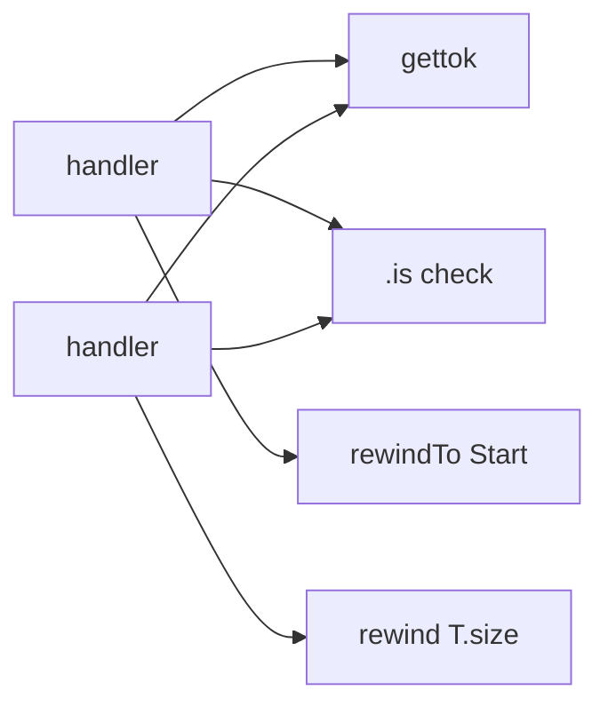

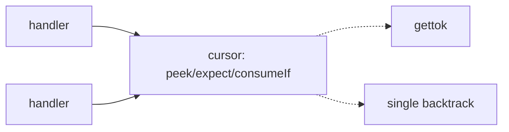

### `environment-scope-shallow-wrapper` — fold the thin `Environment` map wrapper into `Scope` · Worth exploring · score 19/25

- **Files**: `src/include/Environment.h`, `src/Environment.cpp`,
  `src/Interpreter.cpp` (11 `->Vars` reach-throughs). **File-count estimate: 3.**
- **Score 19/25** — leverage 4, locality 4, blast radius 2, heat 3
- **Problem**: `Environment` wraps a single `std::map` with one-line forwards while
  the real behaviour — walking the scope chain — lives in free functions
  `envLookup`/`envSet`; callers touch `Scope::Vars` directly at 11 sites; and
  `envExtend` is dead (defined, never called).
- **Deletion test**: for the `Environment` class specifically — **moves**: deleting
  it just inlines `std::map` calls into `Scope`. That is the shallow-module
  signature; the fix concentrates the load-bearing behaviour onto `Scope`.
- **Solution**: fold `add`/`lookup`(clone-on-lookup)/`clear` into `Scope` as
  `bind`/`lookup`, make `envLookup`/`envSet` members, delete the `Environment`
  class and dead `envExtend`.
- **Benefits**: **leverage** — 11 reach-throughs go through a method; **locality** —
  one scope concept, not two overlapping ones; **test surface** — scope-chain
  lookup testable without the whole interpreter.
- **Recommendation strength**: Worth exploring.

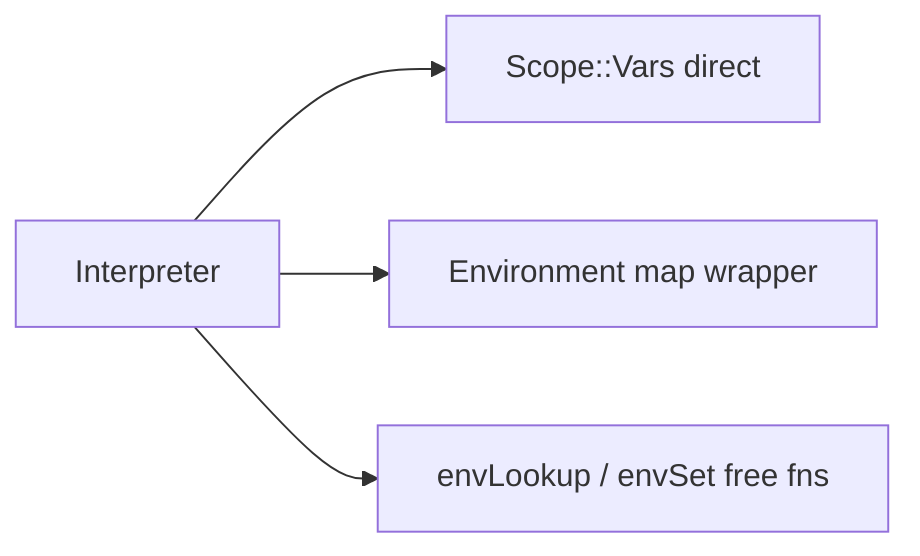

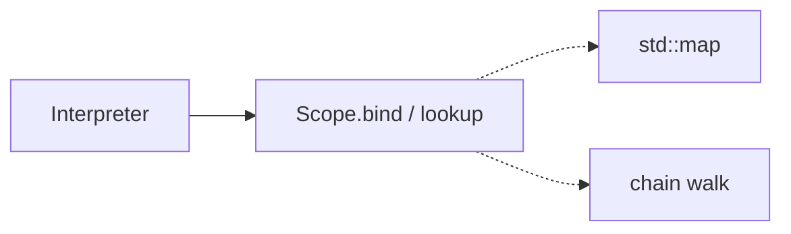

### `visitor-leaf-noop-boilerplate` — a default `visit` hook for the ~15 leaf value kinds · Worth exploring · score 18/25

- **Files**: `src/include/ASTVisitor.h`, `src/Interpreter.cpp:776-842`,
  `src/AnalysisFreeVars.cpp`. **File-count estimate: 3–4.**
- **Score 18/25** — leverage 4, locality 3, blast radius 3, heat 4
- **Problem**: 17 byte-identical self-evaluating `visit` bodies in the interpreter
  and 15 "nothing to do" no-ops in the free-vars analysis exist only because every
  `ASTVisitor` overload is pure-virtual.
- **Deletion test**: **concentrates** — a shared `visitSelfEvaluatingValue` /
  leaf-default hook removes ~32 near-identical bodies.
- **Trade-off (not a blocker)**: the all-pure-virtual design gives a *compile
  error* when a new node kind is added — a real safety property. A deepening must
  keep "new node ⇒ must be handled" for the interesting visitors while defaulting
  only the value-literal group. This raises the blast radius and lowers the score.
- **Recommendation strength**: Worth exploring.

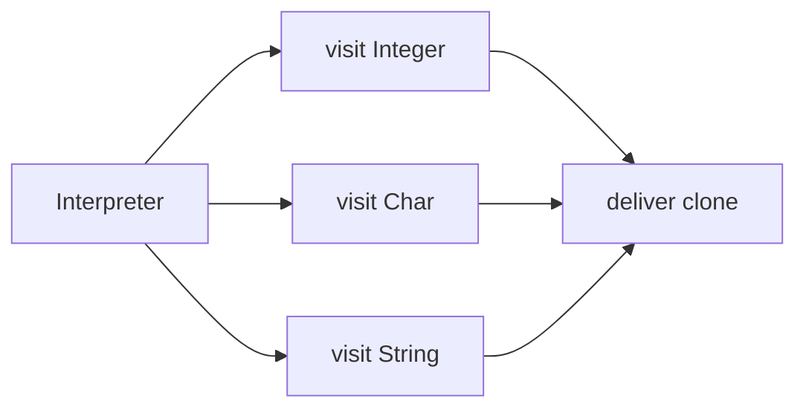

### `ast-range-view-duplication` — one `NodeRange<T>` for the 5 hand-rolled iterator views · Worth exploring · score 17/25

- **Files**: `src/include/AST.h:279,449,533,700,847` (`FormRange`, `IdRange` ×2,
  `LetValues::IdRange`, `Values::ExprRange`), `src/AST.cpp` + iterating call sites.
  **File-count estimate: 2–4.**
- **Score 17/25** — leverage 3, locality 3, blast radius 2, heat 4
- **Problem**: five ~12-line classes each wrap a `begin/end` iterator pair and
  expose exactly `begin()/end()/operator[]`; two even carry the same
  `// FIXME: use C++20 view_interface` comment. Interface ≈ implementation.
- **Deletion test**: **concentrates** — one `template<class T> NodeRange` (or
  `llvm::ArrayRef<T>`) replaces all five.
- **Recommendation strength**: Worth exploring.

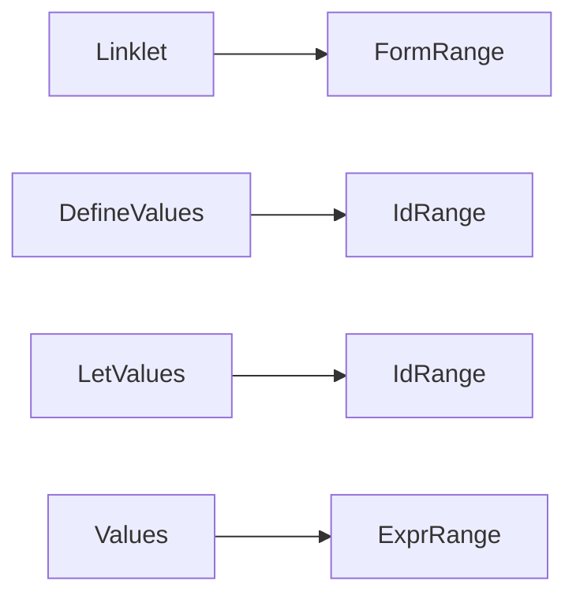

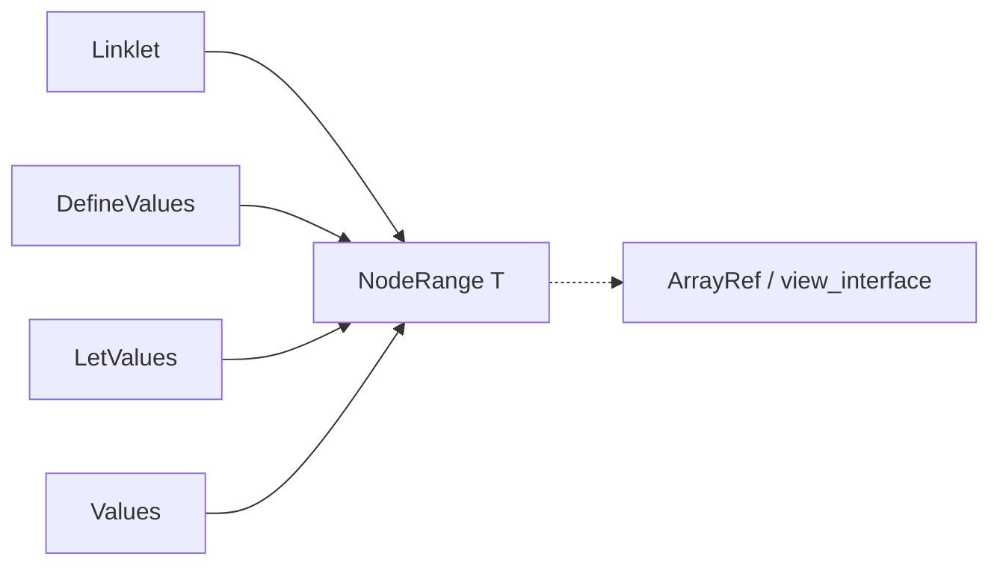

### `keyword-token-table-duplication` — one keyword table drives lex, the symbol predicate, and dispatch · Speculative · score 17/25

- **Files**: `src/Lex.cpp:66-88` (`KnownTokens`), `src/Parse.cpp:355-368`
  (`isSymbolTok`), `src/include/Lex.h:14-54` (`TokType`). **File-count estimate: 3.**
- **Score 17/25** — leverage 3, locality 4, blast radius 2, heat 3
- **Problem**: the reserved-keyword set is maintained as three parallel lists that
  already disagree (`isSymbolTok` lists 20 types, `KnownTokens` 18); the parser's
  `isSymbolTok` re-derives lexer knowledge.
- **Deletion test**: **concentrates** — one table row
  `{ "lambda", LAMBDA, isSymbolInData }` drives all three uses.
- **Recommendation strength**: Speculative — pairs naturally with
  `parse-form-combinator` and `lex-token-cursor-seam` as a later reader cleanup.

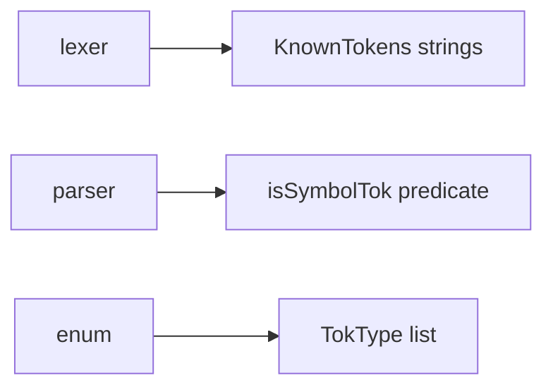

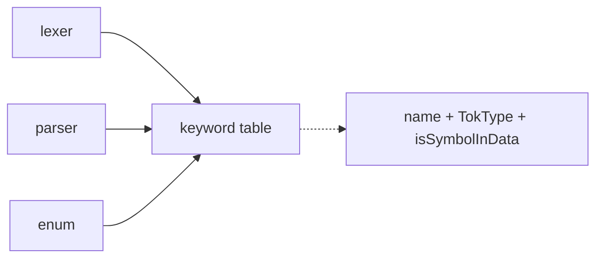

## Dropped

| Candidate | Dropped because |
|---|---|
| `value-handle-passthrough` | Leverage 1 — deletion test *moves*: `Value` today only wraps `unique_ptr<ValueNode>` and every consumer calls `takeLegacy()`. It is the **intentional** in-flight migration seam that becomes a tagged `nr_value` word (`docs/value-model-gc-migration.md` §3); its shallowness is a transitional state, not an accident. Not a fresh opportunity. |
| `formal-clone-boilerplate` | Subsumed by `formal-variant-tag-dispatch`, which reworks the same `Formal` hierarchy; scoring it separately would double-count. Folded in as a sub-item there. |

## Too large to automate

None. No surviving candidate scored blast radius 5 (repo-wide migration). The
largest, `lex-token-cursor-seam` (blast 3, ~70 call sites), is schedulable as a
one-PR change but is deliberately deferred behind its smaller first step,
`parse-form-combinator`.

## Pick

**`parse-form-combinator` (21/25)** is the pick. It edges the runner-up **candidate**,
`runtime-builtin-prologue` (also 21/25), on the deterministic tie-break — **lower
blast radius wins** (1 vs 3): the combinator is contained to the reader with no
published-interface exposure, whereas the builtin-descriptor refactor touches the
argument/return ABI that is mid-migration to `nr_value` and the error text pinned
by integration tests. The two are within 1 point, so `runtime-builtin-prologue` is
the natural next firing once the value-model migration settles. `formal-variant-
tag-dispatch` (20/25) and `lex-token-cursor-seam` (20/25) follow.

**Reconciliation with the in-flight backlog.** The candidate cards above are this
firing's *independent* scan. Reconciling against the backlog carried on PR #141's
branch (7 scored candidates, not yet on `origin/main`) reuses the prior firing's
slugs for the four equivalents — `parse-form-combinator` → `parse-form-combinators`
(scored 20/25 there, blast radius 2; this scan read blast 1 → 21/25),
`formal-variant-tag-dispatch` → `formal-deep-interface` (21/25),
`environment-scope-shallow-wrapper` → `environment-deepen` (18/25),
`visitor-leaf-noop-boilerplate` → `visitor-defaults-dead-code` (16/25) — and folds
in the two incumbents this scan did not re-surface (`frame-per-kind-continuation`
22/25, `bind-result-helper` 19/25) plus this scan's four new finds
(`runtime-builtin-prologue`, `lex-token-cursor-seam`, `ast-range-view-duplication`,
`keyword-token-table-duplication`). In the **merged** ranking the highest-scored
*proposed* candidate is `frame-per-kind-continuation` (22/25) — deprioritised by
#141 for blast radius and risk — with `formal-deep-interface`, `runtime-builtin-
prologue`, and `parse-form-combinators` in a 1-point cluster behind it. See
`.architecture/backlog.md` for the full reconciled list.

**This firing did not implement anything.** PR **#141** ("refactor(ast): route value
printing through one injected raw_ostream seam", branch
`sym/nora/routine/refactor-audit/01M1GPA0JP`, open and mergeable) is an open
architecture PR from the prior firing of this routine. The skill's rule is *one
architecture PR at a time*: a default run stops rather than open a second
concurrent, unreviewable bot PR. This report and the reconciled backlog are
committed as evidence; no design pass ran and no PR was opened. Once #141 merges
(or closes), the next firing re-ranks the merged backlog and implements the leading
proposed candidate test-first. See the run log in `.architecture/backlog.md`.

## Design

No design pass ran. The run bailed at step 2 (reconcile) because open architecture
PR **#141** blocks implementation under the "one PR at a time" rule; design-it-twice
(step 4) and implementation (step 5) were not reached.
