# Architecture review — nora — 2026-09-04

**Scope**: The interpreter (`src/`), weighted to the git hot-spots of recent history — `Interpreter.cpp`, `AST.h`/`AST.cpp`, `Interpreter.h`, `Parse.cpp` are the files that keep changing (proper tail calls, the M2/GC value-model migration, the value-printing seam). Cold code (`Environment.cpp`, the MLIR scaffold) is scored but docked by YAGNI. This is the third firing; it reconciles against a persisted backlog of six candidates and the one that already landed.

**Picked**: `frame-per-kind-continuation` — see PR (opened at step 6) and `.architecture/backlog.md`.

**Degradations**: none. `gh` authenticated; sub-agent exploration and design-it-twice both available; `codebase-design` vocabulary in use.

**Diagram convention** (replaces the upstream HTML legend): in every Mermaid block, **solid edges are the module interface** a caller or the machine driver sees; **dashed edges are inside the implementation**, hidden behind the seam.

---

## Candidates

### frame-per-kind-continuation — one small continuation type per Kind, with `resume()` · Strong · score 22/25

- **Files** — `src/include/Interpreter.h:100` (the `Frame` struct), `src/Interpreter.cpp:143` (`continueStep`, the 13-arm switch), and the 14 push-sites at `Interpreter.cpp:635,647,667,684,711,731,740,750,758` (Eval-mode `visit`s) plus `:109,355,391,569` (driver/internal pushes). File-count estimate: **~3** (`Interpreter.h`, `Interpreter.cpp`, `test/unit/test_interpreter.cpp`).
- **Score — 22/25**
  - *Leverage 5* — the deepening pays back across the whole CEK loop, not one call site: every one of the 13 continuation kinds gains a home for its own fields and its own resume behaviour, and adding a future kind (delimited-continuation prompts, `call/cc` — issue #11) stops touching a shared struct **and** a shared switch **and** scattered field declarations.
  - *Locality 5* — today a continuation kind's data (`Interpreter.h`) is one place, its construction (the `visit` push-site) a second, and its transition (the `continueStep` arm) a third. After: all three sit on one type. A change to how, say, `LetBind` resumes becomes a one-type edit.
  - *Blast radius 3* — only two source files, no published interface (the `Frame` type is entirely private to `Interpreter`; `main.cpp` never sees it), but ~470 lines move and the change crosses the **Boehm-GC seam** (`Kont` is `std::vector<Frame, GcAllocator<Frame>>`, scanned via the stack-resident header), which is why it scores 3 rather than 1 despite the small file count — the band description, not the file range, governs.
  - *Heat 4* — `Interpreter.cpp`/`.h` are the two hottest files in the tree; the tail-call and mark work of the last month lives exactly here.
- **Problem** — `Frame` (`Interpreter.h:100-158`) is a **shallow** module in the precise sense: its interface *is* its implementation. It is a tagged union of everything — a 13-value `Kind` enum and ~20 fields (`Exprs, Idx, Done, Saved, Begin0, ThenE, ElseE, Let, Def, DefEnv, RecScope, AppLoc, SetId, WcmValE, WcmResultE, WcmKeyV, Callee, Marks, Env`), of which each concrete frame uses a handful. Nothing is hidden; every reader must know which fields are live for which `Kind`. The behaviour that gives those fields meaning lives elsewhere, in the 275-line `continueStep` switch (`Interpreter.cpp:143-418`), so understanding one continuation kind means bouncing between the struct, the push-site, and the switch arm. That is the "understanding one concept requires bouncing between modules" smell and the "interface as complex as the implementation" smell at once.
- **Deletion test** — Delete the fat `Frame` + the switch and give each kind its own small type exposing a `resume(Interpreter&)` transition: complexity **concentrates**. Each arm's ~10-30 lines move onto the type that owns exactly the fields it reads; `continueStep` collapses to a one-line dispatch. It does not merely move — the shared-struct-plus-switch coupling is *dissolved*, not relocated. Strong signal.
- **Solution** — Introduce a continuation type per `Kind`, each carrying only its own fields and a `resume(Interpreter&)` (the body of today's switch arm). `continueStep` becomes dispatch over the top continuation. Keep a common header — at minimum `Marks` (read by `snapshotMarks` for *every* frame, `Interpreter.cpp:602`; written by `setMark` on the top activation, `:389,392`) and the `Callee`/reuse concept for the three tail-reusable activation kinds (`Call`, `WcmMark`, `Halt` — the predicate at `:387,559`). The exact representation (a `std::variant` payload vs a GC-allocated polymorphic base vs a transition table) is the step-4 design question; every candidate design must keep `Kont` GC-scannable.
- **Benefits** — *Leverage*: the machine driver (`run`, `continueStep`) shrinks to dispatch; each kind is independently readable and independently testable. *Locality*: a new continuation kind is one new type, not edits in three coupled places. *Test surface*: today the only way to exercise `LetBind`'s resume is to parse and run a `let-values` program end to end; a per-kind `resume()` can be unit-tested against a constructed continuation, and the bounded-space invariant (`getPeakKont`) is pinned before anything moves.

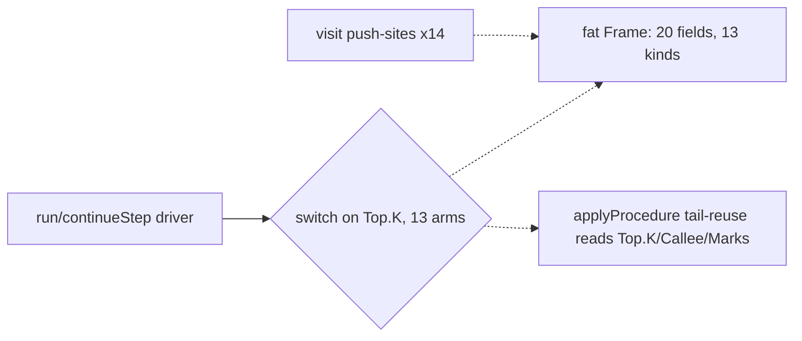

Above: one driver switches on a tag into a fat shared struct that every push-site and the tail-call logic also reach into (dashed = all internal, nothing hidden).

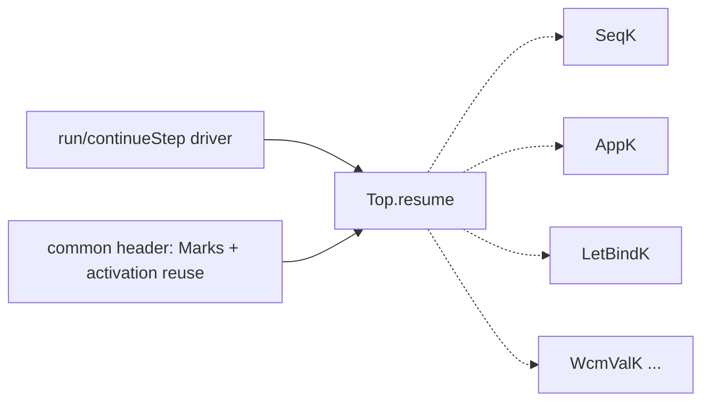

Below: the driver calls one `resume()` interface; each continuation kind hides its own fields and transition; only the universal marks/activation-reuse header is shared.

---

### formal-deep-interface — give the `Formal` tag real behaviour · Strong · score 21/25

- **Files** — `src/include/AST.h:489` (the 3-class `Formal` hierarchy whose whole virtual interface is `clone()`+`getType()`), re-dispatched at `Interpreter.cpp:85` (`formalsAccept`), `:466` (duplicated closure-arity check), `:512` (arg-binding), `AST.cpp:237` (`Lambda::dump`), and `AnalysisFreeVars.cpp:43`. Estimate: ~3 files.
- **Score — 21/25** — *Leverage 4*: five sites decode one tag; a deep `accepts`/`bind`/`collectNames` collapses them and deletes the `applyProcedure`↔`formalsAccept` duplication. *Locality 4*: adding a formal kind (keyword args) becomes one subclass, not five edits. *Blast radius 1*: 3 internal files, no published interface. *Heat 4*.
- **Problem** — `Formal` carries zero behaviour; every operation is a caller switching on `getType()` and `static_cast`-ing down. It is the most shallow module in the tree by the interface-vs-implementation measure. A live bug rides along: `Interpreter.cpp:514,521,534` bind with `auto LF = static_cast<const ast::ListFormal &>(F)` — `auto` deduces a **value**, deep-copying the formal's `SmallVector<Identifier>` on every application; `formalsAccept` (`:85`) uses `auto&` and proves the fix.
- **Deletion test** — Replace the tag + `getType()` with virtuals: five scattered switches concentrate into three method bodies next to the data. Concentrates.
- **Solution** — `bool accepts(size_t) const`, `void bind(...) const`, `void collectNames(set&) const`, `void dump(...) const` on `Formal`, overridden per subclass.
- **Benefits** — *Leverage*: arity/binding/dump stop re-dispatching; the closure path reuses `accepts`. *Locality/test surface*: each formal kind's behaviour is unit-testable directly on the node.
- **Recommendation strength** — Strong. Runner-up **candidate**; the natural next firing.

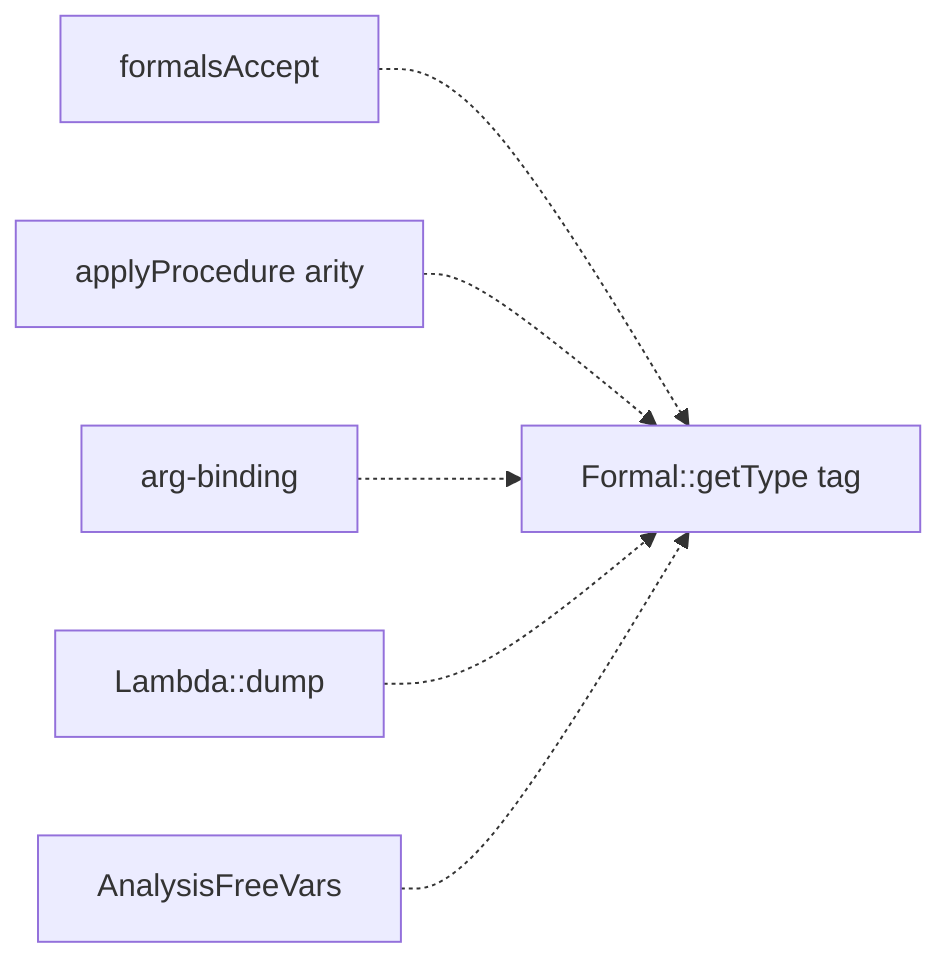

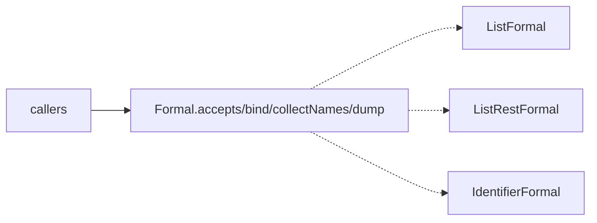

---

### parse-form-combinators — collapse the form prologue behind combinators · Worth exploring · score 20/25

- **Files** — `src/Parse.cpp` (form parsers `parseLambda:707`, `parseCaseLambda:759`, `parseSetBang:981`, `parseIfCond:1105`, `parseLetValues:1238`, `parseWithContinuationMark:1164`, `parseVariableReference:1033`, `parseLinklet:628`, …), `src/include/Parse.h`. Estimate: ~2 files.
- **Score — 20/25** — *Leverage 4*, *Locality 4*, *Blast radius 2* (the parser + its unit test), *Heat 4*.
- **Problem** — Every keyword-led form opens with the identical `getPosition / gettok(LPAREN) / rewindTo / gettok(keyword) / rewindTo` prologue: the LPAREN guard appears 22×, `rewindTo(Start)` 53×, the `if (!hadError) parseError` emit-once idiom 18×. `parseExpr` (`Parse.cpp:211`) is a 14-alternative linear try-chain that re-lexes the leading `(`+keyword per alternative. The per-`parseX` interface hides almost nothing beyond that shared prologue.
- **Deletion test** — A `parseParenForm(keyword, body)` combinator plus a keyword→parser dispatch table concentrates the "(`(`, keyword) → parser" knowledge into one helper and one map. Concentrates — but there is a genuine ordering constraint (`Parse.cpp:281`: `quote` must precede application), so the table must model keyword-vs-application precedence; it is deep, not merely mechanical.
- **Solution** — `openForm`/`expect` combinators for the prologue; a keyword-keyed table for `parseExpr` dispatch.
- **Benefits** — *Leverage/locality*: the prologue lives once; adding a form is a table row. *Test surface*: `test_parse.cpp` already unit-tests parsers directly.
- **Recommendation strength** — Worth exploring — large internal churn in the hottest-but-most-fragile file.

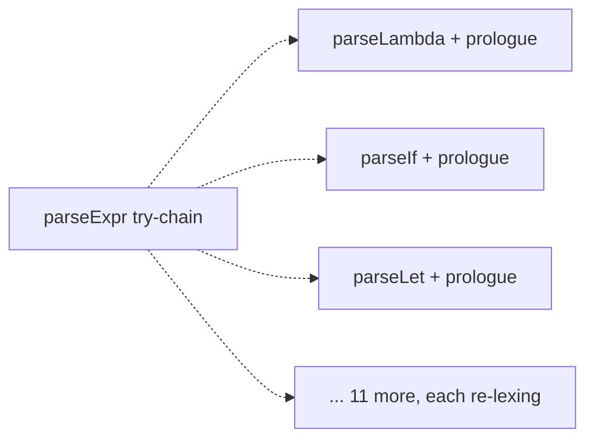

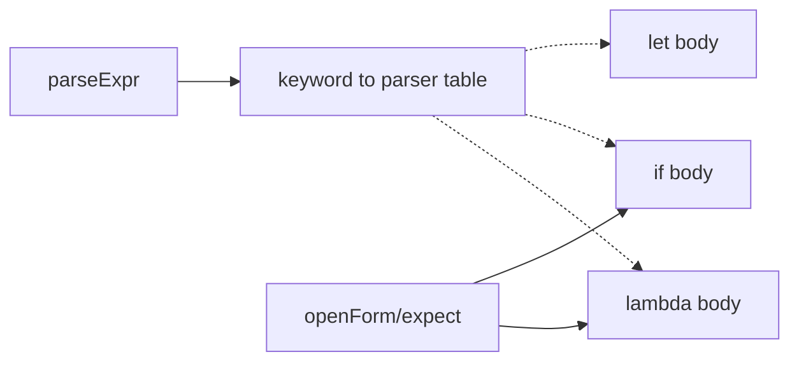

---

### bind-result-helper — one destructuring seam for let/letrec/define · Worth exploring · score 19/25

- **Files** — `src/Interpreter.cpp:54` (`bindValues`, used by `LetBind`/`LetRec`) and `:303` (the inline `Frame::Define` arm that re-implements it). Estimate: 1-3 files.
- **Score — 19/25** — *Leverage 3*, *Locality 4*, *Blast radius 1*, *Heat 4*.
- **Problem** — Multiple-values destructuring exists twice: `bindValues` and a hand-rolled copy in the `Define` arm, with cosmetically divergent diagnostics (`"let-values binding expected …"` vs `"define-values expected …"`) and a duplicated clone-loop (`:75` and `:323`). The concept "bind N results to N ids" has no single home.
- **Deletion test** — Fold `Define` onto a shared `bindResult(ids, value, contextLabel)`: concentrates; one arity/clone path, one place for the wording.
- **Solution** — A single helper parameterised by the context label so `let-values`/`define-values` diagnostics are preserved exactly.
- **Benefits** — *Locality/test surface*: one place to change and to FileCheck-pin the arity-mismatch messages.
- **Recommendation strength** — Worth exploring — small and contained; lower leverage than the pick.

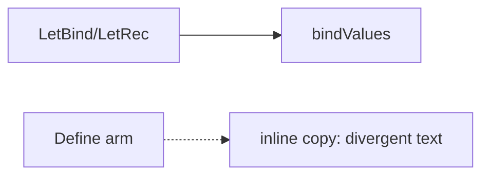

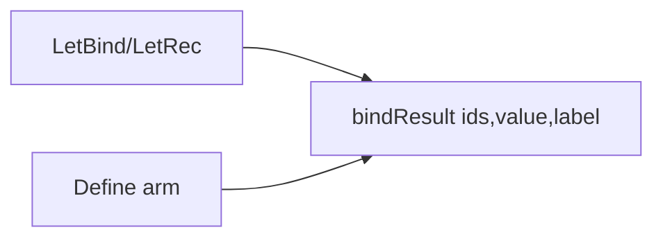

---

### environment-deepen — one scope module owning its own lifetime · Speculative · score 18/25

- **Files** — `src/include/Environment.h:8` (`Environment` leaks its `std::map` via `begin()/end()`), `Environment.h:41` (`Scope`, a method-less struct), `Environment.cpp:19` (chain ops as free functions), and `Interpreter.cpp:37,44,208` (the interpreter owns cycle-breaking via `AllScopes`). Estimate: ~4 files.
- **Score — 18/25** — *Leverage 4*, *Locality 4*, *Blast radius 2*, *Heat 2* (cold — YAGNI docks it).
- **Problem** — The "environment" concept is four fragments: a map-leaking wrapper, a bare `Scope`, free chain-functions, and — the tell — a lifetime/cycle-breaking policy that lives in the *client* (`~Interpreter` clears `AllScopes`), not in the module. The abstraction does not own its own invariant.
- **Deletion test** — Borderline. Folding chain-walking into `Scope` methods **and** moving scope allocation + teardown into an arena concentrates the policy; merging only the free functions would just move it. The win depends on the arena absorbing teardown.
- **Solution** — A scope/arena module with `contains()`, arena ownership, pointer-identity keys, and teardown responsibility; delete the leaked map surface.
- **Benefits** — *Locality*: lifetime policy stops straddling module and client. Couples to the in-progress `Value`/GC migration, so best scheduled alongside it.
- **Recommendation strength** — Speculative — cold code; coordinate with GC work.

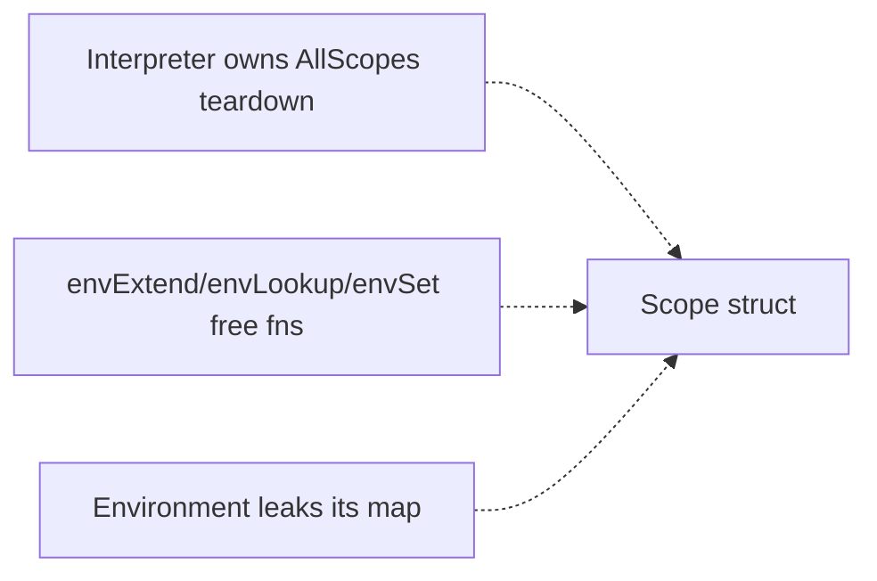

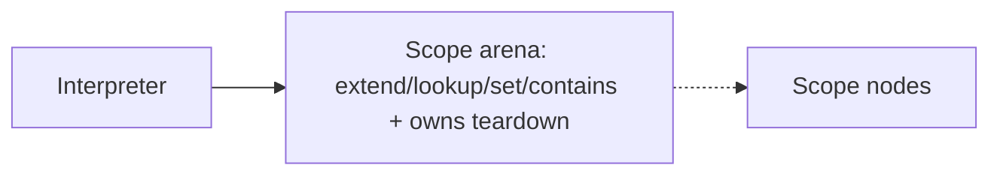

---

### visitor-defaults-dead-code — default the visitor, delete the dead pass · Speculative · score 16/25

- **Files** — `src/include/ASTVisitor.h:11` (29 pure virtuals), `src/AnalysisFreeVars.{cpp,h}` (a 221-line `ASTVisitor` subclass instantiated nowhere — only referenced by `CMakeLists.txt:26`), `AST.h:649` (`Lambda::findFreeVariables` declared, never defined), and `Interpreter.cpp:776-842` (17 byte-identical `deliver(clone())` self-quoting overrides). Estimate: ~3-5 files.
- **Score — 16/25** — *Leverage 3*, *Locality 3*, *Blast radius 2*, *Heat 3*.
- **Problem** — Two smells bundled: dead weight (`AnalysisFreeVars` + the undefined declaration are compiled/declared but unreachable) and a too-wide interface (29 pure virtuals forcing an override in every visitor, one of which is dead; plus 17 identical value-node overrides that a single `visitSelfQuoting` hook would collapse).
- **Deletion test** — Removing the dead pass concentrates (pure removal). Collapsing the 17 overrides concentrates. Both good; but the dead-code half is cleanup, not deepening.
- **Solution** — Default the pure virtuals to no-ops; remove `AnalysisFreeVars` and the undefined declaration; optionally add a `visitSelfQuoting(ValueNode const&)` hook.
- **Benefits** — *Leverage*: adding a node kind stops forcing a no-op override in a dead visitor. *Test surface*: removal is verified by the existing suite staying green.
- **Recommendation strength** — Speculative — lowest leverage; the deepening and the cleanup are really two changes.

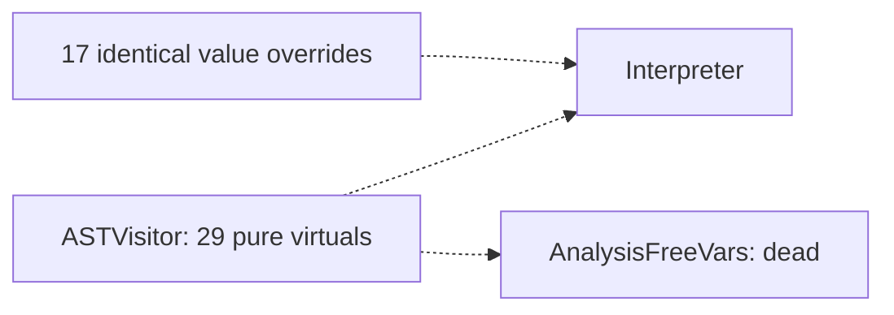

---

## Dropped

| Candidate | Dropped because |
|---|---|
| `runtime-primitive-boilerplate` | Not a deepening — `Runtime::callFunction` (`Runtime.cpp:513`) is already a deep module: a one-line hash-map dispatch over `RUNTIME_FUNC`-registered polymorphic primitives. Leverage 1: the only smell (per-primitive `clone()`/`accept()` boilerplate, `FIXME` arithmetic error paths) would move complexity, not concentrate it. Recorded to prevent re-proposal. |
| `value-handle-deepen` | The `Value` handle (`Value.h:13`) is a deliberately thin `unique_ptr<ValueNode>` wrapper for the in-progress M2/GC value-model migration (documented at `Value.h:8`). Its shallowness is transitional by design; deepening now would contradict work in flight. Recorded to prevent re-proposal. |

## Too large to automate

None this run. No surviving candidate scored blast radius 5. The largest, `frame-per-kind-continuation`, is blast radius 3 — big in lines but contained to two private source files plus one test, with no published interface crossed — so it is one-PR work.

## Pick

**`frame-per-kind-continuation`, 22/25.** With `value-printing-raw-ostream-seam` reconciled to `landed` (PR #141 merged 2026-09-03), it is the top-scoring surviving `proposed` candidate. It clears every hard filter: leverage 5 (not 1), blast radius 3 (not 5), contradicts no ADR (there are none), status `proposed` (not landed/rejected/dropped/in-flight), and its behaviour is pinnable — `test/unit/test_interpreter.cpp:40-81` already asserts the bounded-`getPeakKont` tail-call invariant a continuation refactor could break, and `with-continuation-mark` semantics are FileCheck-pinned in integration `.rkt`s.

It outranks the runner-up **candidate**, `formal-deep-interface` (21/25), by a single point — **the top two are within 1 point**, so this pick was close and `formal-deep-interface` is the natural next firing. `frame-per-kind-continuation` wins on leverage (5 vs 4, doubled in the total): its deepening pays back across the entire 13-kind CEK loop and unblocks the delimited-continuation follow-ups (issue #11), whereas the runner-up, though lower-risk, pays back only across the five `Formal`-tag decode sites.

The prior firing's note that this candidate "wants characterization tests first" is satisfied by the method itself: step 5 pins the bounded-space and mark invariants with tests, watches them pass on the unrefactored machine, and only then moves the frames.

## Design

Written at step 4 (design-it-twice + adjudication), after this report was first committed; the section is appended below by amending this file.
