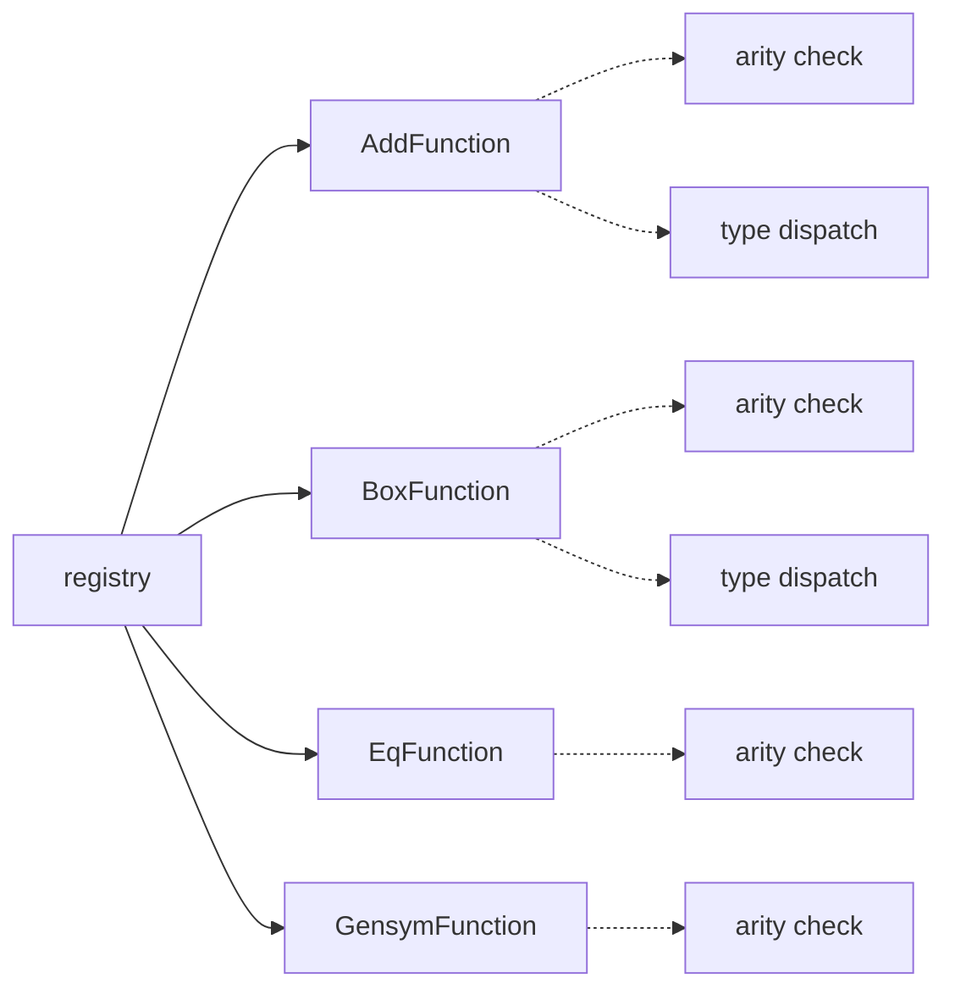
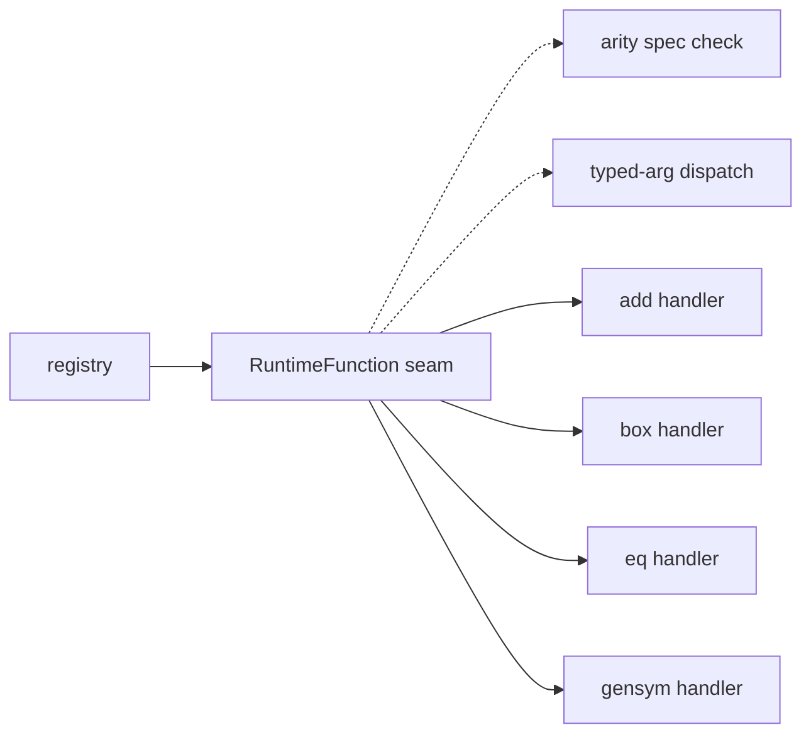
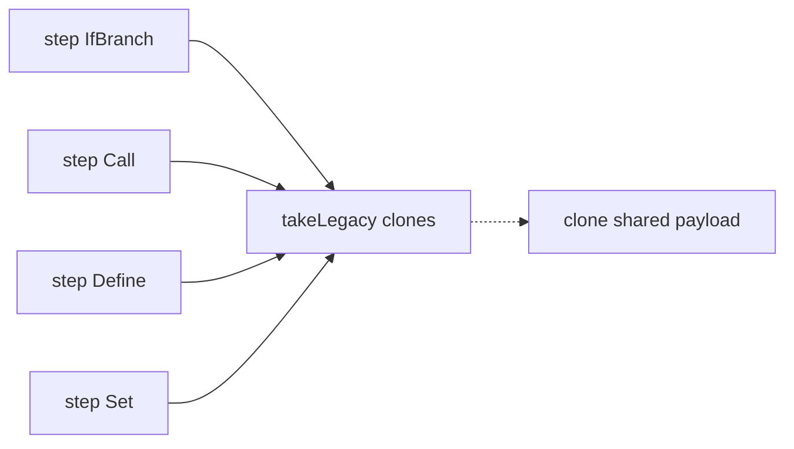
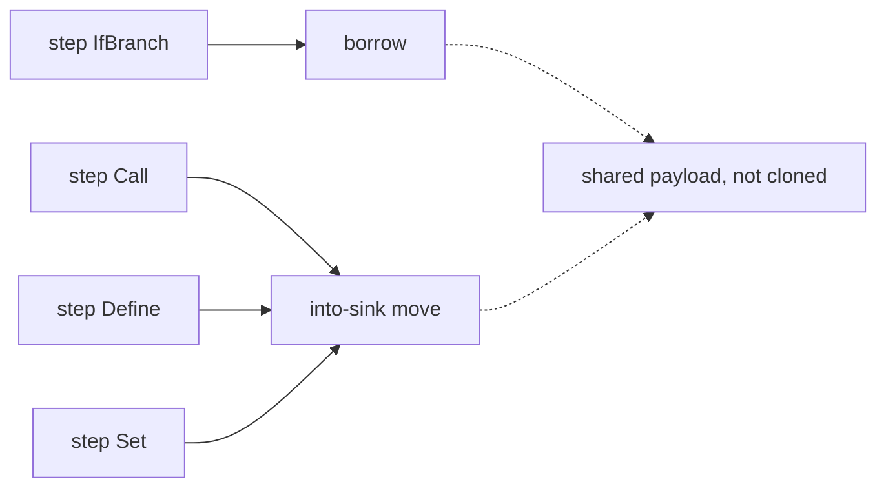

# Architecture review — nora — 2026-09-10

**Scope**: `src/` (the interpreter), excluding `src/mlir/` (an unused, opt-in
scaffold). Hot spots from the last ~15 commits (M2/GC work) drove attention to
`src/Runtime.cpp`, `src/Interpreter.{h,cpp}`, `src/ASTRuntime.{h,cpp}` and
`src/include/Value.h`; the five candidates carried over from the 2026-09-02
review were re-verified against the current tree.

**Picked**: `runtime-builtin-boilerplate` — see PR (below) and
`.architecture/backlog.md`.

**Degradations**: advisor rate-limited this firing — the design adjudication
(step 4) was done against the written designs in the `## Design` section rather
than by the advisor, and is noted there. No flags forced; sub-agents available;
`gh` authenticated. Branch **adopted**
(`sym/nora/routine/refactor-audit/01M25W8YV7`): non-default, no unique history
(`rev-list --count origin/main..HEAD` = 0), no upstream, unpublished on origin —
kept the caller's name, not renamed.

**Diagram legend**: solid edges are the interface a caller sees; dashed edges
are inside the implementation, hidden behind the seam.

---

## Candidates

### runtime-builtin-boilerplate — collapse 18 hand-rolled builtin prologues behind one deep RuntimeFunction seam  ·  Strong  ·  score 24/25

- **Files** — `src/Runtime.cpp:1-521` (18 `RuntimeFunction` subclasses + the
  `RUNTIME_FUNC` registry table `:489-508`), `src/include/Runtime.h:26-44`
  (lookup/dispatch), `src/include/AST.h:977-1004` (the `RuntimeFunction` base).
  Caller unchanged: `src/Interpreter.cpp:420-441`. File-count estimate: **3**
  (`Runtime.cpp`, `Runtime.h`, `AST.h`).
- **Score — 24/25**
  - **Leverage 5** — the arity check (`if (Args.size() != N) return nullptr;`)
    and the per-arg `dyn_cast<T>` → `return nullptr` prologue are re-derived in
    all 18 builtins, as are the byte-identical `clone()` (`new XFunction(*this)`)
    and `accept()` (`V.visit(*this)`) tails. One deep seam collapses all four
    across every builtin, and a whole class of "construct the wrong-arity /
    wrong-type case" test setup with it.
  - **Locality 5** — adding or changing a builtin becomes a one-place edit (a
    table row + a typed handler); today it is a new 3-method class plus a
    registry line.
  - **Blast radius 2** → contributes `(6-2)=4`. Every builtin shares **one**
    `ASTNodeKind::AST_RuntimeFunction` (`AST.h:980`) and **one** visitor overload
    `visit(ast::RuntimeFunction const&)` (`ASTVisitor.h:31`), so collapsing the
    subclasses touches neither the `ASTNodeKind` enum, the visitors, nor RTTI.
    The `nullptr`→`"invalid arguments to '<name>'"` contract is emitted by the
    *caller* (`Interpreter.cpp:436`), so the test-pinned diagnostic
    (`test/integration/error-plus-type.rkt`) is preserved untouched. Contained
    to `Runtime.{cpp,h}` + the `AST.h` base.
  - **Heat 5** — `Runtime.cpp` is in the hottest tier (7 touches since
    2026-09-02: the M2/GC value-handle and continuation-mark work).
- **Problem** — `RuntimeFunction` is a **shallow** base: its interface is a bare
  `operator()(SmallVector<const ValueNode*>)` returning `nullptr` on any
  failure, so every one of the 18 subclasses re-implements the same three
  concerns by hand — arity validation, positional type-dispatch, and the
  clone/accept plumbing — before it gets to its actual job. The interface hides
  nothing; the subclasses *are* the prologue plus a few lines of real logic. The
  overloaded `nullptr` channel also conflates "wrong arity", "wrong type", and
  "runtime failure", which is why the caller can only ever print one generic
  message.
- **Deletion test** — **concentrates.** Delete the 18 subclasses in favour of a
  registration table of `{name, arity-spec, typed-handler}` and the arity/type
  dispatch stops being copied 18 times and lives once, behind the seam; each
  handler shrinks to its core logic. `RuntimeFunction` itself stays — it is a
  real, load-bearing node type — but its subclasses' boilerplate does not just
  move to a new home, it disappears into a single shared implementation.
- **Solution** — Give `RuntimeFunction` a deep interface that owns arity and
  argument-type checking. Each builtin is registered as data: a name, an arity
  specification (exact / at-least / range, to fit variadic `+ - *` and
  optional-arg `gensym`), and a handler that receives already-validated
  arguments. The 18 classes become 18 table rows plus 18 small handler bodies
  with **their existing logic unchanged** — only the shared prologue and the
  clone/accept tails are lifted out.
- **Benefits** — **Leverage**: one seam serves every current and future builtin;
  the arity/type prologue is written once and tested once. **Locality**: a
  builtin's definition is one place, not a class scattered across a 521-line
  file. **Test surface**: the seam makes "reject wrong arity" and "reject wrong
  type" directly exercisable through one interface instead of 18, and lets a
  future change give arity vs type failures distinct diagnostics without
  touching callers.

Above: 18 subclasses, each re-rolling its own arity/type prologue (only four
shown). Below: one seam validates arity and argument types; handlers are pure
logic.

### value-register-take-vs-borrow — stop the Value handle leaking take-vs-borrow to every step arm  ·  Worth exploring  ·  score 22/25

- **Files** — `src/include/Value.h:52-67` (the `get()` / `takeLegacy()` /
  `toShared()` trio); step arms `src/Interpreter.cpp:187-189, 294-298, 329-331,
  388-390, 396-398`. File-count estimate: **1-2** (`Interpreter.cpp`, optionally
  a borrow helper on `Value`).
- **Score — 22/25**
  - **Leverage 4** — six step arms stop choosing between three near-synonymous
    accessors; several become plain borrows, undoing the clones that #195/#196
    just removed elsewhere.
  - **Locality 4** — the value-lifetime decision concentrates in the `Value`
    seam instead of being re-made per arm.
  - **Blast radius 1** → `(6-1)=5`. `Interpreter.cpp` only; no published
    interface.
  - **Heat 5** — the single hottest file; `Value.h` landed days ago.
- **Problem** — `Value` exposes both representations (owned `Legacy`, shared
  `Shared`) through three accessors, so every caller must know which to call.
  `takeLegacy()` silently *clones* a shared value; several arms that only read
  the value, or hand it straight to a `Value`-typed sink, call it anyway —
  re-introducing the copies the value-model migration exists to remove. Two
  conventions now coexist in one file.
- **Deletion test** — **concentrates** (borrow vs into-sink logic lands on
  `Value`), but the win is partly perf-regression cleanup, and the code sits in
  the GC-critical, mid-migration core where an aliasing mistake is costly —
  hence *Worth exploring*, not *Strong*.
- **Solution** — Give `Value` a borrow path and an into-sink move that never
  clones a shared value, and route the read-only / pass-through arms through it;
  keep `takeLegacy()` only where an owned `unique_ptr` is genuinely required.
- **Benefits** — **Leverage/locality** as above; **test surface**: value
  aliasing across `(let ([y x]) …)` and `set!` becomes pinnable at the seam.

### formal-deep-interface — give the shallow Formal tag a deep interface  ·  Strong  ·  score 21/25

- **Files** — `src/include/AST.h:489-570` (`Formal` hierarchy), dispatch sites
  `src/Interpreter.cpp:88-98` (`formalsAccept`), `:445-475` (duplicated arity
  check in `applyProcedure`), `:495-527` (arg-binding), `src/AST.cpp:239-254`
  (dump). File-count estimate: **3**.
- **Score — 21/25** — leverage 4, locality 4, blast radius 1 → `(6-1)=5`, heat 4.
- **Problem** — `Formal` carries a `Type` tag and callers `static_cast` + switch
  on it at four sites; the closure-arity logic is duplicated between
  `formalsAccept` and the inline check in `applyProcedure`; the arg-binding arm
  copies the identifier vector by value (`auto LF = static_cast<...>(F)` at
  `Interpreter.cpp:499, 519`).
- **Deletion test** — **concentrates**: `accepts(NArgs)` / `bind(args, scope)` /
  `boundVars()` on the hierarchy remove all four switches.
- **Confirmed unchanged** by #191/#195/#196. This was the 2026-09-02 review's
  designated next firing; it is outranked this firing by two fresh candidates.
  Before/after diagrams: see `2026-09-02-value-printing-raw-ostream-seam.md`
  sibling context — the shape is the standard tag-switch → virtual-dispatch
  collapse.

### parse-form-combinators — fold the repeated parse prologue into combinators  ·  Worth exploring  ·  score 20/25

- **Files** — `src/Parse.cpp`, `src/include/Parse.h`. Estimate ~2 files, large
  internal churn.
- **Score — 20/25** — leverage 4, locality 4, blast radius 2 → 4, heat 4.
- Unchanged since 2026-09-02 (`Parse.cpp` last touched well before the GC
  churn). The `getPosition/gettok/rewind` prologue (22× LPAREN guard, 53×
  rewind) and the emit-once idiom fold into `openForm`/`expect` combinators.

### bind-result-helper — one bindResult helper for multiple-values destructuring  ·  Worth exploring  ·  score 19/25

- **Files** — `src/Interpreter.cpp` (`bindValues:54` vs the inline `Frame::Define`
  arm). Estimate ~1-3.
- **Score — 19/25** — leverage 3, locality 4, blast radius 1 → 5, heat 4.
- **Friction grown**: the two arms now also diverge on the `Value` seam
  (`bindValues` passes/borrows a `Value`; the `Define` arm `takeLegacy()`s then
  re-wraps), on top of the pre-existing 1-id/N-id duplication with divergent
  error text. Overlaps `value-register-take-vs-borrow`.

### continuation-mark-query-seam — pull the mark key-scan into ContinuationMarkSet  ·  Worth exploring  ·  score 19/25

- **Files** — `src/Runtime.cpp:129-186` (two builtins re-implement the scan),
  `src/include/ASTRuntime.h:154-174`, `src/ASTRuntime.cpp:102-149`. Estimate ~3.
- **Score — 19/25** — leverage 3, locality 4, blast radius 2 → 4, heat 5.
- `ContinuationMarkSet` exposes only `getFrames()` (a raw nested vector);
  `continuation-mark-set-first` and `continuation-mark-set->list` both reach
  past the seam and re-implement the same innermost-first key scan. It should
  offer `firstForKey(key)` / `allForKey(key)`. The agent also flagged a bundled
  **eq-drift** (mark keys compared by `valueEq` = symbol *name*, while `eq?`
  compares symbol *identity*) — a correctness change that is **scope creep** for
  a pure seam extraction and is excluded from this candidate's estimate; it is
  left for a human as a possible separate fix.

### environment-deepen — one scope module with contains/arena/pointer-identity  ·  Speculative  ·  score 19/25

- **Files** — `src/include/Environment.h`, `src/Environment.cpp`, `src/AST.cpp`,
  `src/Interpreter.cpp`. Estimate ~4.
- **Score — 19/25** (was 18) — leverage 4, locality 4, blast radius 2 → 4,
  heat 3 (was 2; #195 added `toShared()`/`Value::share` and `envSet` still walks
  the chain twice via `lookup`+`add`). Still below the pick; borderline deletion
  test (win depends on the arena absorbing teardown).

### visitor-defaults-dead-code — default ASTVisitor no-ops; delete dead AnalysisFreeVars  ·  Speculative  ·  score 16/25

- **Files** — `src/include/ASTVisitor.h`, `src/AnalysisFreeVars.{cpp,h}`,
  `src/Interpreter.cpp`, CMake. Estimate ~3-5.
- **Score — 16/25** — leverage 3, locality 3, blast radius 2 → 4, heat 3.
- Unchanged: 17 byte-identical `deliver(clone())` self-quote overrides
  (`Interpreter.cpp:749-813`) and a still-dead `AnalysisFreeVars` pass. The
  dead-code half is a cleanup, not a deepening; lowest leverage.

## Dropped

No candidate tripped a hard filter this firing. Two prior candidates are
excluded because they are already `landed` in the backlog (the
already-in-backlog filter), not because of a friction filter:

| Candidate | Excluded because |
|---|---|
| `value-printing-raw-ostream-seam` | Backlog `landed` — PR #141 merged 2026-09-03 |
| `frame-per-kind-continuation` | Backlog `landed` — PR #191 merged 2026-09-04 (reconciled from `in-flight` this firing) |

## Too large to automate

None. No candidate scored blast radius 5.

## Pick

**`runtime-builtin-boilerplate` (24/25)** outranks the runner-up **candidate**
`value-register-take-vs-borrow` (22/25) by 2 points — not a close call by the
rubric. It is the textbook high-leverage "sibling functions repeat the same
prologue" collapse the deepening playbook flags by name, and the coupling audit
showed it is far more contained than it first appears: the 18 builtins share a
single AST node kind and a single visitor overload, so the change never leaves
`Runtime.{cpp,h}` + the `AST.h` base and never touches the enum, the visitors,
RTTI, or the caller's diagnostic contract.

This deviates from the 2026-09-02 review's designated next firing
(`formal-deep-interface`, 21/25), which remains live and unchanged. The
deviation is not a re-prioritisation on taste: two *fresh* candidates surfaced
by this firing's scan of the M2/GC hot spots score above it under the same
deterministic rubric, and `runtime-builtin-boilerplate` is the top of them. A
future firing over an unchanged tree re-derives the same ranking.

The runner-up candidate `value-register-take-vs-borrow` is the natural next
firing, though it sits in GC-critical, mid-migration code and should be handled
with care.

## Design

<!-- Written in step 4; the file is committed before the design pass runs. -->
