# Architecture review — nora — 2026-09-11

**Scope**: The M2/GC immediate-migration hot spot — `src/Interpreter.cpp`,
`src/include/Value.h`, `src/Runtime.cpp`, `src/include/AST.h`, and the runtime
supporting files. Chosen because the last stretch of `git log` (S5–S7 immediates
#197/#199/#201, the `toShared()` fix #198, the builtin-registry seam #200) keeps
landing there; deepening pays off where change concentrates.
**Picked**: `value-register-take-vs-borrow` — see the PR and `.architecture/backlog.md`.
**Degradations**: advisor rate-limited at the approach-validation call (step 3);
will retry at step-4 adjudication and fall back to self-adjudication against the
written designs if still limited. Sub-agent exploration was available and used.

> **Diagram legend**: solid edges are the module's public interface; dashed
> edges are calls that live *inside* the implementation, behind the seam.

## Candidates

### value-register-take-vs-borrow — give the `Value` register a borrow seam · Strong · score 22/25

- **Files**: `src/include/Value.h`, `src/Interpreter.cpp:198,306,341,400,408`
  (the five avoidable sites); file-count estimate **~2**.
- **Score**: 22/25
  - **Leverage 4** — five `step`/apply arms stop reaching for the consume-or-clone
    path; the whole register-handoff idiom in the hot interpreter loop simplifies,
    and the avoidable clones #195/#196 removed stop creeping back.
  - **Locality 4** — the take-vs-peek decision moves *onto the handle* instead of
    being re-made, representation-aware, at every call site.
  - **Blast radius 1** — one header seam plus five one-line call-site edits, no
    published interface; ~2 files.
  - **Heat 5** — `Value.h` (5×) and `Interpreter.cpp` (9×) are the hottest files
    in the recent window; this is exactly the mid-migration code S8 will touch next.
- **Problem** — `Value` carries three representations (`Legacy` unique_ptr,
  `Shared` shared_ptr, `Imm` immediate word) and exposes three consuming/peeking
  reads: `get()` (peek, non-consuming, non-cloning), `takeLegacy()`
  (consume, **and clone if `Shared`**), `toShared()` (consume into a binding).
  The *cost* of `takeLegacy()` depends on which representation is engaged, and
  that leaks: five interpreter arms reflexively call `takeLegacy()` where they
  only need to **borrow** (read through the handle) or to **move the whole handle
  into a sink that already takes a `Value`**. Each such call clones a shared
  value for nothing — re-introducing exactly the copies #195/#196 removed.
- **Deletion test** — **PASS**. A borrow seam on `Value` concentrates the
  peek-vs-consume choice behind the handle. Delete it and the choice re-smears
  across the arms, each re-deciding — representation-aware — whether to clone.
  Complexity concentrates, it does not merely move.
- **Solution** — Recognise (and make explicit at the interface) that `Value`
  already sinks by move — `deliver(Value)`, `envSet(…,Value)`,
  `Environment::add(…,Value)`, `toShared()` all take a `Value` — and that `get()`
  is the non-cloning borrow. Add a small, intent-named borrow accessor so the
  read-only arms stop consuming, then route the five avoidable sites:
  - `IfBranch` fallback (198): borrow instead of `takeLegacy()` to read the bool.
  - `WcmMark` (400) / `Call` (408): `deliver(std::move(Val))` — pass the handle
    straight through, no materialise-and-clone.
  - `Set` (341): `envSet(E, *Id, std::move(Val))` — the sink takes a `Value`.
  - `Define` single-id (306): `add(id, std::move(Val))`; multi-id inspection
    borrows rather than consuming.
  `takeLegacy()` stays only for the three **genuine** into-`unique_ptr<ExprNode>`
  sinks (`MkValues` 237, `applyProcedure` rest/id children 525/534), which are
  rooted in AST nodes storing `unique_ptr` children (the value-in-AST conflation)
  — explicitly out of scope here.
- **Benefits** — *leverage*: the register handoff in the hottest loop becomes
  uniform (move to sink, borrow to read); *locality*: "does this clone?" is
  answered once, by the handle, not per arm; *test surface*: the borrow/no-clone
  invariant becomes unit-pinnable — build two `Value`s over one `shared_ptr`,
  borrow/move one, and assert pointer identity is preserved (no clone) — which is
  impossible to state against the current representation-leaking surface.

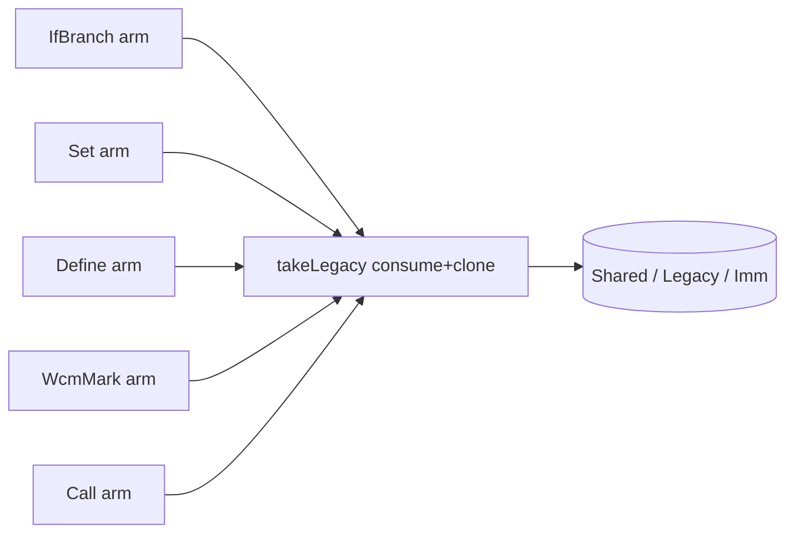

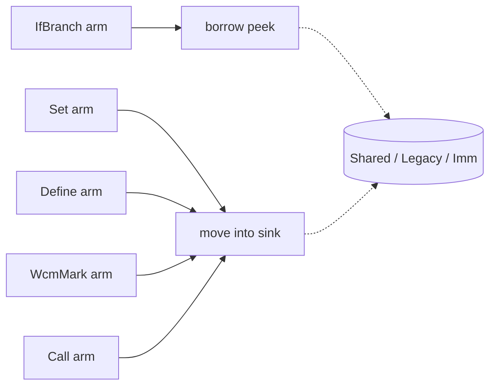

### formal-deep-interface — give the `Formal` tag a deep interface · Worth exploring · score 21/25

- **Files**: `src/include/AST.h`, `src/AST.cpp:238-266`, `src/Interpreter.cpp:91-99,463-539`,
  `src/AnalysisFreeVars.cpp:43-52`; estimate ~3.
- **Score**: 21/25 — **leverage 4** (five `Formal::Type` re-dispatch sites collapse;
  fixes the per-application `auto` copy of the identifier `SmallVector`);
  **locality 4** (arity/binding/dump own their behaviour once per subclass);
  **blast radius 1** (~3 files, no published surface); **heat 4**.
- **Problem** — `Formal` exposes only its `getType()` tag; arity (`formalsAccept`),
  the duplicated closure-arity check in `applyProcedure`, argument binding,
  `Lambda::dump`, and the (dead) `AnalysisFreeVars` all switch on the tag and
  re-`static_cast`. The interface is a tag; the behaviour lives in the callers —
  shallow. `Lambda::getFormalsType()` (AST.h:729) is a tag-leak accessor with
  no production callers (5 test sites only).
- **Deletion test** — **PASS**. `accepts(nargs)` / `bind(...)` / `boundVars()` /
  `dump()` virtuals concentrate five re-dispatches into one per-subclass body.
- **Solution** — Move the per-`Type` behaviour behind virtuals on `Formal`;
  callers ask `F.accepts(n)` / `F.bind(...)`. Drop the callerless `getFormalsType`.
- **Benefits** — leverage across five sites; the switch-and-cast idiom (and its
  `auto`-copy footgun) disappears; adding a new formal kind stops touching five
  files. Test surface: each formal kind's arity/binding testable in isolation.

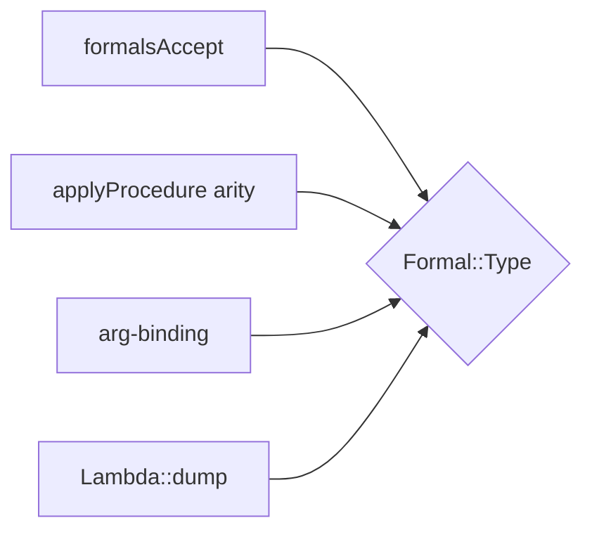

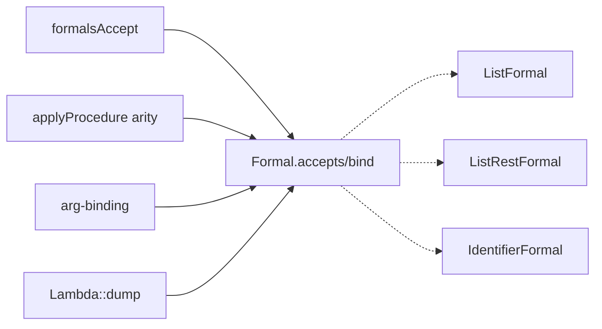

### clone-unique-wrap — one owning-clone seam instead of 26 wrap-sites · Worth exploring · score 19/25 *(new)*

- **Files**: `src/include/AST.h` (the `ClonableNode` template, :132-146), and 26
  wrap-sites across `Interpreter.cpp`, `Runtime.cpp`, `ASTRuntime.cpp`, `AST.cpp`;
  estimate ~5.
- **Score**: 19/25 — **leverage 4** (26 identical `unique_ptr<T>(x->clone())`
  wraps collapse; a leak-prone ceremony is centralised); **locality 3**;
  **blast radius 2** (~5 files, mechanical, no published surface); **heat 4**.
- **Problem** — `ASTNode::clone()` returns a raw owning `ASTNode*` (covariant
  `ValueNode*`), and every one of 26 callers re-wraps it into a `unique_ptr`.
  The interface hands out a raw owning pointer; each caller performs the same
  ownership ceremony. `Formal::clone()` already returns `unique_ptr<Formal>` —
  the deep version to mirror.
- **Deletion test** — **PASS**. A `cloneUnique(node)` / non-virtual `clonePtr()`
  owns the wrap once; deleting it scatters the ceremony back to 26 sites.
- **Solution** — Add a non-virtual `clonePtr()` on `ClonableNode` (or a free
  `cloneUnique`), keeping the virtual's covariant raw return (unique_ptr is not
  covariant, so the virtual must stay raw). Route the 26 sites through it.
- **Benefits** — leverage across 26 sites; ownership handled once; the raw
  `clone()` stops being the thing callers reach for. Test surface: unchanged
  behaviour, pinned by existing tests.

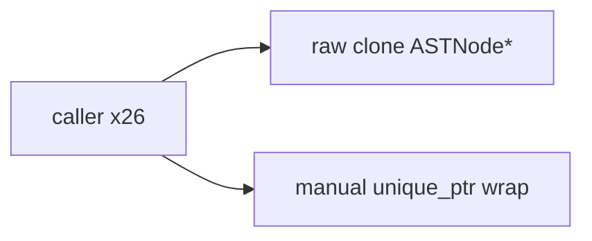

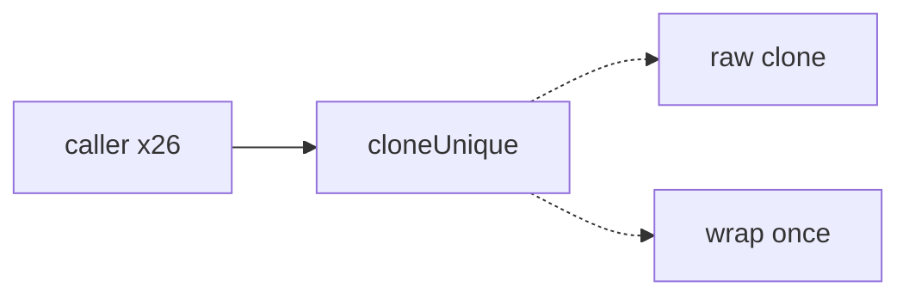

### range-adapter-dedup — one generic range instead of five hand-rolled adapters · Worth exploring · score 19/25 *(new)*

- **Files**: `src/include/AST.h` (`DefineValues::IdRange` :536-547, `ListFormal::IdRange`
  :620-630, `LetValues::IdRange` :787-800, `Linklet::FormRange` :282-294,
  `Values::ExprRange` :934); estimate ~1-2.
- **Score**: 19/25 — **leverage 3** (three byte-identical `IdRange` classes and
  two sibling adapters collapse to one generic; the code's own FIXMEs at :534 and
  :784 ask for it); **locality 4**; **blast radius 1** (1-2 files, all `AST.h`);
  **heat 4**.
- **Problem** — Five hand-rolled range adapters, three of them byte-identical,
  each with an interface (`begin`/`end`/`operator[]`) as large as its body — the
  textbook shallow module. The FIXMEs admit a `view_interface` was intended.
- **Deletion test** — **PASS**. One `IterRange<T>` (or `std::ranges::subrange`)
  concentrates the adapter; the five copies were pure boilerplate.
- **Solution** — Replace the five with one generic range type / `subrange`.
- **Benefits** — deletes duplicated boilerplate; one place to fix a range bug.
  Test surface: existing range-for iteration tests cover it.

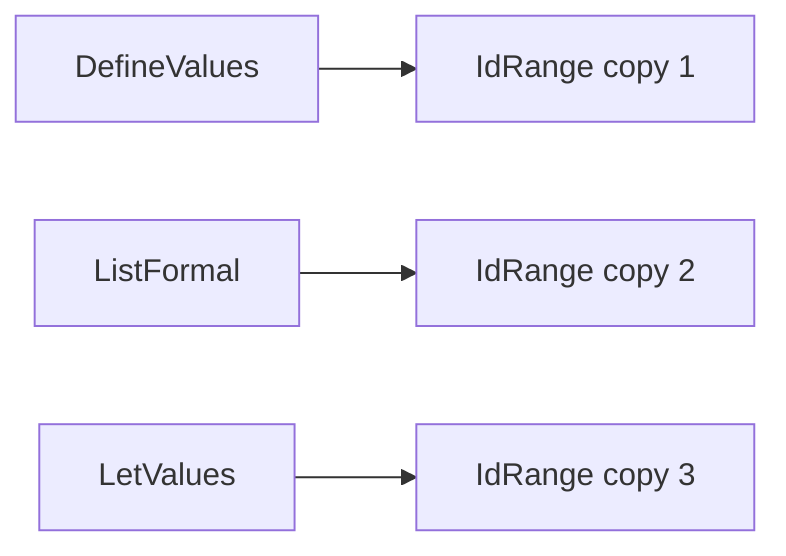

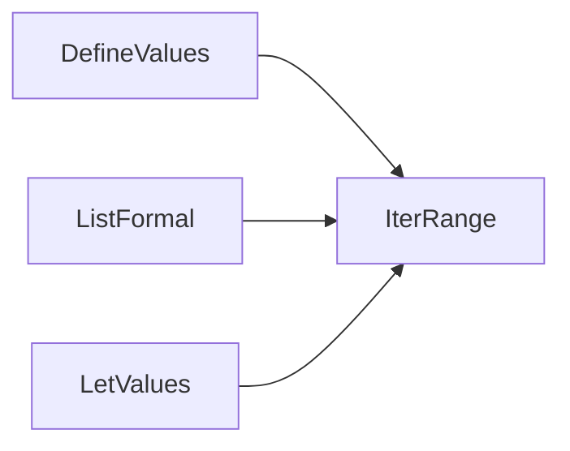

### parse-form-combinators — fold the form prologue into combinators · Worth exploring · score 20/25

- **Files**: `src/Parse.cpp`, `src/include/Parse.h`; estimate ~2 (~18 form parsers).
- **Score**: 20/25 — **leverage 4**, **locality 4**, **blast radius 2**, **heat 4**.
- **Problem** — Every form parser repeats a `getPosition`/`gettok`/LPAREN-guard/
  `rewindTo` prologue (22 LPAREN guards, 55 `rewindTo`, 18 emit-once guards) and
  the `if (!hadError) parseError` idiom. The save/rewind/emit-once invariant is
  re-implemented per parser.
- **Deletion test** — **PASS**. `openForm(S, keyword)` / `expect(S, tok, msg)`
  combinators own the invariant once.
- **Solution** — Extract the combinators; a keyword→parser table for `parseExpr`.
- **Benefits** — the invariant lives once; each parser shrinks to its shape.
  Test surface: existing parse unit tests plus new combinator-level tests.

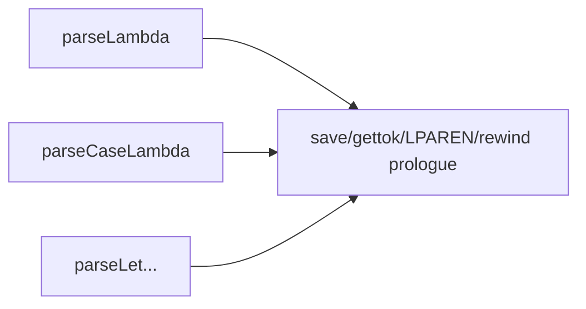

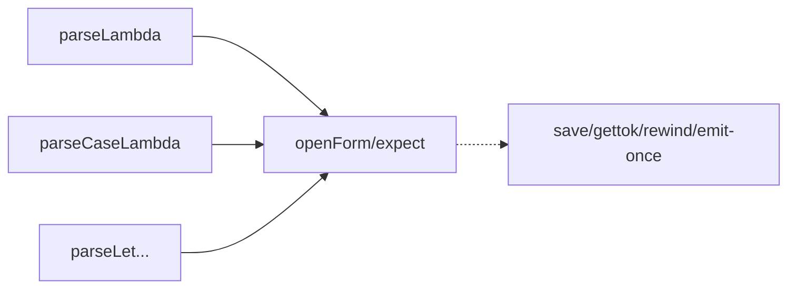

### continuation-mark-query-seam — a query seam on `ContinuationMarkSet` · Worth exploring · score 19/25

- **Files**: `src/Runtime.cpp:82-89,105-113`, `src/include/ASTRuntime.h:164`,
  `src/ASTRuntime.cpp`; estimate ~3.
- **Score**: 19/25 — **leverage 3**, **locality 4**, **blast radius 2**, **heat 5**.
- **Problem** — `ContinuationMarkSet` exposes only `getFrames()`;
  `continuation-mark-set-first` and `continuation-mark-set->list` both reach past
  it and re-implement the same innermost-first key scan.
- **Deletion test** — **PASS**. `firstForKey(key)` / `allForKey(key)` own the scan.
- **Solution** — Add the two query methods; both builtins call them.
  (The bundled `valueEq`-by-name vs `eq?`-by-identity drift is a correctness
  concern excluded from this pure seam extraction — left for a human.)
- **Benefits** — the scan lives once; the builtins shrink to a query call.
  Test surface: the scan becomes unit-testable on `ContinuationMarkSet` directly.

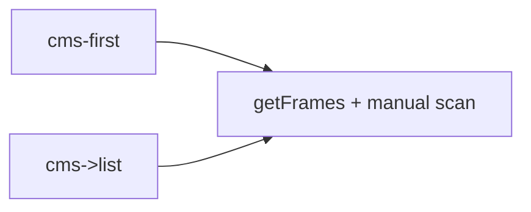

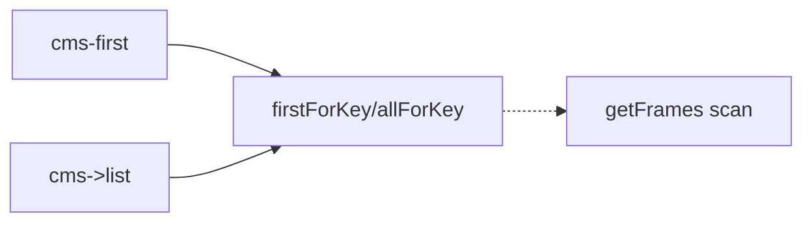

### bind-result-helper — one destructuring helper for let/letrec/define · Worth exploring · score 19/25

- **Files**: `src/Interpreter.cpp:60-87` (`bindValues`) and `:303-336` (inline
  `Frame::Define` arm); estimate ~1.
- **Score**: 19/25 — **leverage 3**, **locality 4**, **blast radius 1**, **heat 4**.
- **Problem** — `bindValues` and the inline `Define` arm both do 1-id/N-id
  multiple-values destructuring, duplicated with divergent error text and (now)
  divergent `Value`-seam handling (overlaps `value-register-take-vs-borrow`).
- **Deletion test** — **PASS**. One `bindResult` helper owns the arity/destructure/
  error contract.
- **Solution** — Extract `bindResult`; route both arms through it. Best sequenced
  *after* the `Value`-seam pick so the two arms share the same borrow handling.
- **Benefits** — one destructuring contract; consistent error text.
  Test surface: destructuring arity errors testable once.

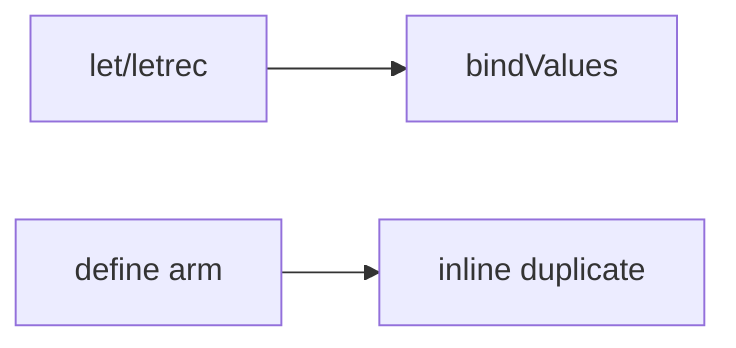

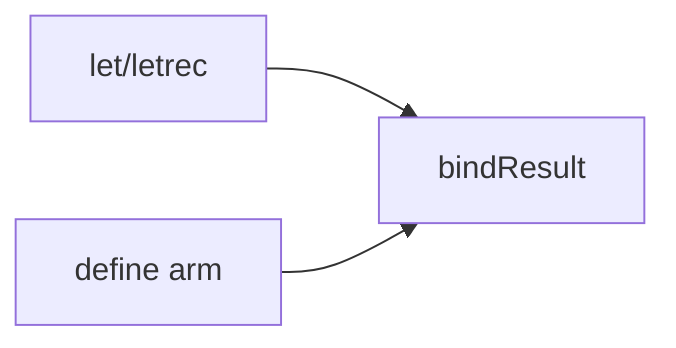

### environment-deepen — one scope module owning teardown · Worth exploring · score 19/25

- **Files**: `src/include/Environment.h`, `src/Environment.cpp`, and the
  interpreter-owned `AllScopes` half in `src/include/Interpreter.h` /
  `src/Interpreter.cpp:40-58`; estimate ~4.
- **Score**: 19/25 — **leverage 4**, **locality 4**, **blast radius 2**, **heat 3**.
- **Problem** — Understanding one binding means bouncing across `Environment`,
  `Scope`, free functions (`envExtend`/`envLookup`/`envSet`), and the
  interpreter-owned cycle-breaking. `envSet` fabricates a whole `Value` (a
  discarded refcount bump) just to test presence; a `contains()` predicate is
  missing. Dead surface: `envExtend`, `Environment::begin/end` have zero callers.
- **Deletion test** — **borderline-PASS**. The win depends on an arena/scope
  module absorbing the `AllScopes` teardown plus `contains()`, not merely moving
  free functions onto methods.
- **Solution** — Fold the scope chain + teardown into one module with
  `contains()`, arena ownership, and pointer-identity keys; delete the dead surface.
- **Benefits** — one place to understand binding lifetime; presence test without
  fabricating a `Value`. Test surface: teardown/cycle-breaking becomes testable
  without an `Interpreter`.

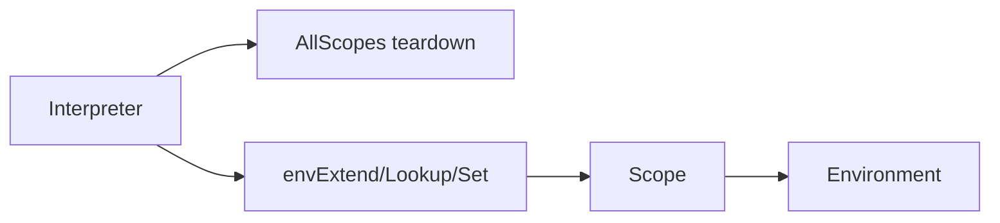

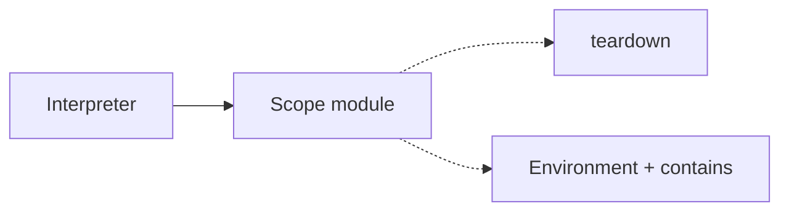

### visitor-defaults-dead-code — default the visitor, delete the dead pass · Speculative · score 16/25

- **Files**: `src/include/ASTVisitor.h:11-39`, `src/AnalysisFreeVars.{cpp,h}`,
  `src/Interpreter.cpp:761-825`, CMake; estimate ~3-5.
- **Score**: 16/25 — **leverage 3**, **locality 3**, **blast radius 2**, **heat 3**.
- **Problem** — 29 pure-virtual `visit` methods force every visitor to override
  all; `AnalysisFreeVars` is entirely dead (and its `visit(Identifier)` is
  latently buggy); `Lambda::findFreeVariables` is declared, never defined;
  14 byte-identical `deliver(clone())` self-quoting overrides remain (was 17;
  #199/#201 immediates removed 3).
- **Deletion test** — **PASS on the dead half** (delete `AnalysisFreeVars` +
  `findFreeVariables`); the no-op-defaults + a `visitSelfQuoting` hook is a
  genuine but low-leverage narrowing.
- **Solution** — Default the visitor's pure virtuals to no-ops; delete the dead
  pass and undefined declaration; optionally collapse the self-quoting overrides.
- **Benefits** — less required boilerplate per visitor; dead code gone.
  Test surface: unchanged.

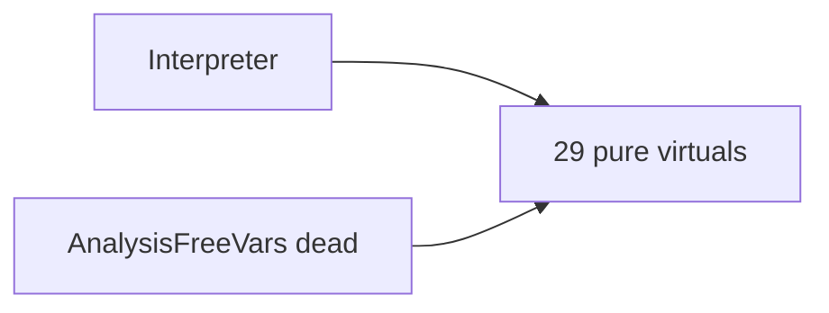

### operand-accumulate-seam — one advance-or-finish seam across step arms · Speculative · score 18/25 *(new)*

- **Files**: `src/Interpreter.cpp:207-251` (`step(App)`, `step(MkValues)`,
  `step(LetBind)`); estimate ~1.
- **Score**: 18/25 — **leverage 3**, **locality 2**, **blast radius 1**, **heat 5**.
- **Problem** — `step(App)`, `step(MkValues)`, and `step(LetBind)` share a
  byte-identical accumulate-then-advance prologue; only the "all done" epilogue
  differs.
- **Deletion test** — **PASS (modest)**. An `advanceOrFinish(K)` seam owns the
  operand state machine.
- **Solution** — Extract the accumulate/advance prologue; keep the per-arm epilogue.
- **Benefits** — the operand loop lives once. Test surface: unchanged.

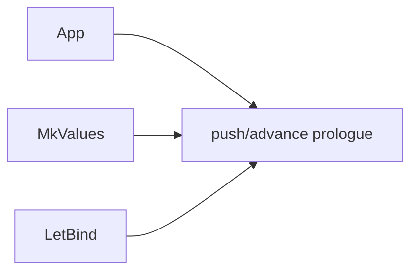

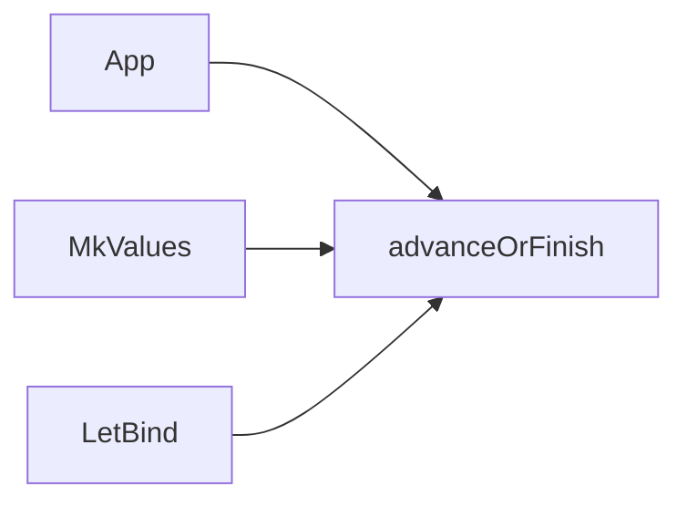

## Dropped

| Candidate | Dropped because |
|---|---|
| `abort-eval-fail-helper` (`Diag.error; abortEval; return` epilogue ×11) | Leverage 2 — a 3-line epilogue collapse; interface barely deepens, callers do the same work. Recorded for the next run, not picked. |

## Too large to automate

None this run — no candidate scored blast radius 5.

## Pick

**`value-register-take-vs-borrow` (22/25)** is taken. It is the top surviving
`proposed` candidate after `runtime-builtin-boilerplate` (#200) merged, and it
was already recorded as the prior run's "natural next firing." The runner-up
**candidate** is `formal-deep-interface` (21/25) — **within 1 point**, so this
pick was close and `formal-deep-interface` is the natural next firing. The pick
wins on heat (5 vs 4): it sits in the exact mid-migration `Value`/interpreter
code the next slice (S8 fixnums) will touch, so the borrow seam pays off soonest,
and its blast radius (~2 files, one header seam + five one-line edits) is the
smallest of the top tier.

New candidates `clone-unique-wrap` and `range-adapter-dedup` (both 19/25) score
below the pick and are recorded in the backlog for future firings.

## Design

_Filled in at step 4 (design-it-twice + adjudication)._
